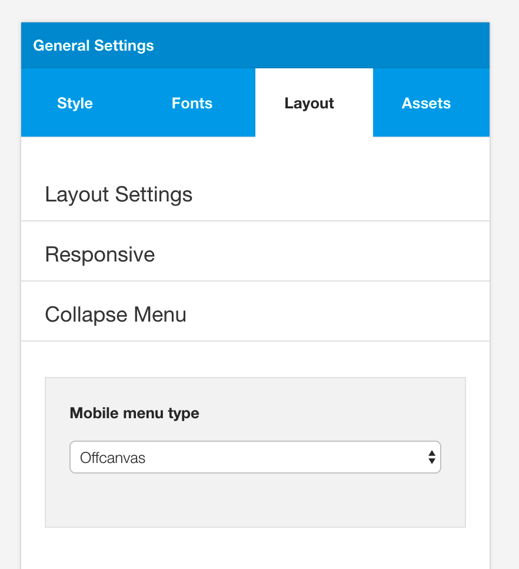

**This document is still being developed** 

The Grid4 design is a child theme of the Build.r template. This means it uses the Build.r template and applies Grid4 specific style via Build.r's builtin child theme functionality.

## A note about child themes
Child themes are an additional less file and optional javascript file that are included in the main theme css and javascript, when selected in the template settings. You can read a full explanation of child theming in Build.r <a href="../style/using-child-themes">here</a>.

## Installing Grid4

The following applies to situations where you have already installed the Buildr template on your site or are installing buildr for the first time.

**Step 1** - Download and install the latest version of the <a href="http://www.joomlabamboo.com/downloads/template-downloads?param=buildr">Buildr template</a>.

**Step 2** - Once installed navigate to the template manager and edit the Buildr template.

**Step 3** - Select the Grid4 example configuration from the load saved settings dropdown.

After doing this the Grid4 child theme will be selected and the Grid4 preset will be set in the preset dropdown list.

Applying the Grid 4 example configuration sets the required theme panel options including the layout blocks used on the demo site in the layout tool.

**Step 4** - Click Save. After clicking save the required assets for the Grid4 theme will be generated (theme files, css files etc) and will now be available for use on your website.

## Install the Grid4 quickstart package

If you are starting a new website from scratch we highly recommend installing the Grid4 quickstart package. This is by far the simplest way to recreate the demo site on your server.

Learn about <a href="http://docs.joomlabamboo.com/getting-started/how-to-install-a-joomla-3-quickstart-package">installing the quickstart package</a>.

## Recreating the Grid4 demo site

## Description of elements

## Background image and overlay

## Logo

## Menu

## Top right more button

**What is this?**

The more button int he top right of the screen is the offcanvas trigger button. This is a layout block that can be moved around the layout and placed anywhere you like. On the demo site the button is positioned in the top-right layout area.

**The display of the offcanvas trigger can be found on the menu panel under the off-canvas section**
 

In particular please note that the demo uses the Empty btn button style and the text for the offcanvas uses syntax from the Zen Shortcode plugin to render the menu bar.

**Offcanvas content**

The Offcanvas menu has a login module published to it and can be seen in the offcanvas across all screensizes.

On screensizes small than the navcollapse breakpoint a menu is dynamically added to the offcanvas. 
offcanvas-smallscreens.

This menu is added to the offcanvas panel because offcanvas is selected as the mobile menu option.

## Featured grid

**What is this?**

It's an instance of the Zentools2 module displaying images from a folder published to the grid1 position.

In the quickstart package this module is called Frontpage Grid.

**The following are important screenshots of the Zentools2 settings used to generate this display.**

## About me sidebar

**What is this?**

It's a custom html module published to the grid4 position on the front page and sidebar-2 on the sub pages.

**Markup used**

	

	
 

	
I am an artist. A lover of good coffee and ... A dreamer of dreams.  

	
<a class="btn-empty" href="index.php/contact">Get in Touch</a>

There are two instances of this module published so as to make the module available on the front page  (grid4) next to the frontpage grid and on the sub pages next to the main content (sidebar-2).

## Social icons below about me module

**What is this?**

The icons below the about block are rendered via the template's built in social icon block. The social icon block is capable of displaying advanced and simple linking functionality for Facebook, Pinterest, Twitter and Google Plus as well as display icons from other popular social networking sites.

**Social icon template settings**
The position and display settings for the Social icons are found in the design panel in the template settings.

**Social Icons in the Layout area in the design panel**

**Display settings in the design panel side panel**

