**In Progress**

OnePageTwo2 is a child theme of the Build.r template. This means it uses the Build.r template and applies OnePageTwo2 specific style via Build.r's built in child theme functionality.

## A note about child themes
The files for child themes are located in the templates/buildr/child folder and are selected in the template admin design side panel.  You can read a full explanation of child theming in Build.r <a href="../style/using-child-themes">here</a>.

## Installing OnePageTwo2

The following applies to situations where you have already installed the Buildr template on your site or are installing buildr for the first time.

**Step 1** - Download and install the latest version of the <a href="http://www.joomlabamboo.com/downloads/template-downloads?param=buildr">Buildr template</a>.

**Step 2** - Once installed navigate to the template manager and edit the Buildr template.

**Step 3** - Select the OnePageTwo2 example configuration from the load saved settings dropdown.

After doing this the OnePageTwo2 child theme will be selected and the OnePageTwo2 preset will be set in the preset dropdown list.

Applying the Grid 4 example configuration sets the required theme panel options including the layout blocks used on the demo site in the layout tool.

**Step 4** - Click Save. After clicking save the required assets for the OnePageTwo2 theme will be generated (theme files, css files etc) and will now be available for use on your website.

## Install the OnePageTwo2 quickstart package

If you are starting a new website from scratch we highly recommend installing the OnePageTwo2 quickstart package. This is by far the simplest way to recreate the demo site on your server.

Learn about <a href="http://docs.joomlabamboo.com/getting-started/how-to-install-a-joomla-3-quickstart-package">installing the quickstart package</a>.

## Recreating the OnePageTwo2 demo site

## Description of elements

## Logo

The logo is a custom html module published to the logo position that uses the following markup:

	<h1>OnePageTwo</h1>
	
A fullscreen one page theme

The font used in the logo is a google font called <a href="https://www.google.com/fonts/specimen/Poiret+One">'Poiret One'</a>.

Fonts are controlled in the Build.r template in the General Settings sidepanel

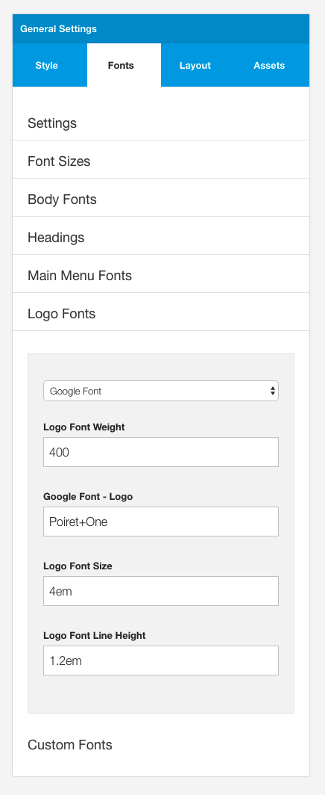

### Notes about the logo position:

- The logo position is placed in the toolbar row in the template design tool. 
- It sits side by side the one page menu block. 
- The toolbar position in the Build.r template is designed to stay at the top of the screen. 
- The vertical and horizontal padding is determined by the settings in the row

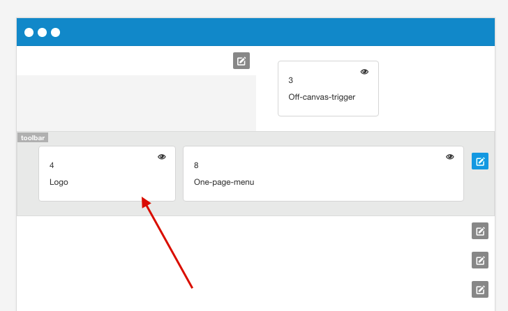

## Menu
The menu seen in the demo of the OnePageTwo template is an example of the One Page Menu block.

### Menu Position
The menu can be moved around the layout however for best results it is recommended that the one page menu is added next to the menu block in the toolbar row.
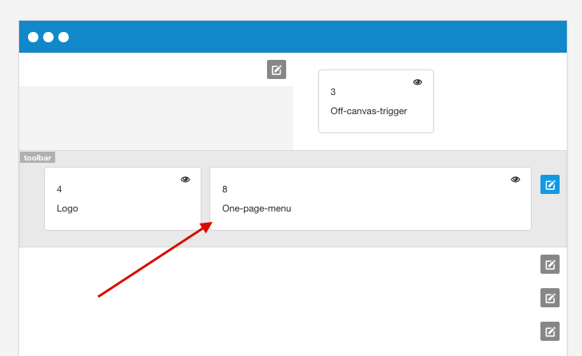

### Menu Content

The content for the menu is determined by two factors:

- Whether there is a title specified in the menu section of the template settings.
- Whether there is a module published to the corresponding row.

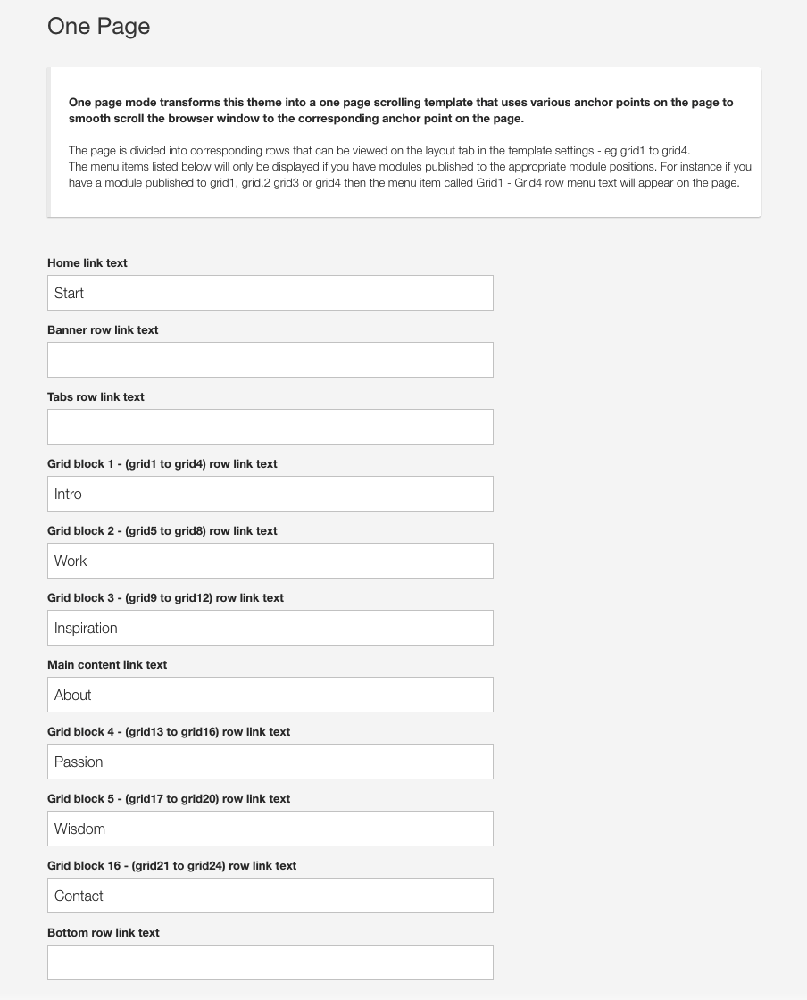

If a menu item is not assigned to the row of modules in the template admin then the menu item will not show. However if there is a title assigned in the template settings, but there is no module published to any of the positions assigned to that row then the menu item will also not show.

### Menu Fonts
The font used in the menu is Roboto and it has a font weight of 300.

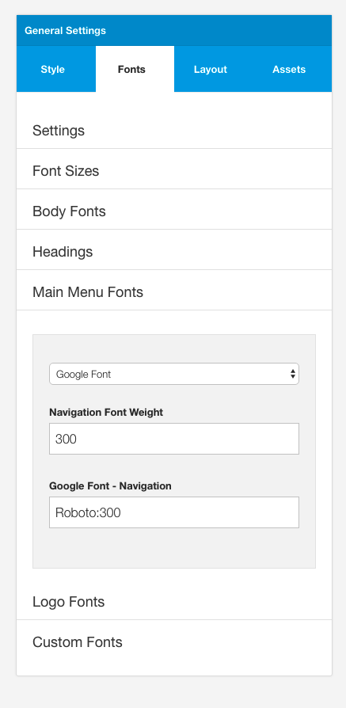

### Menu Style

The colors used to display the menu can be controlled in the style panel of the general settings side panel. 

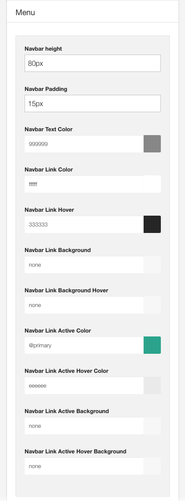

## First Image
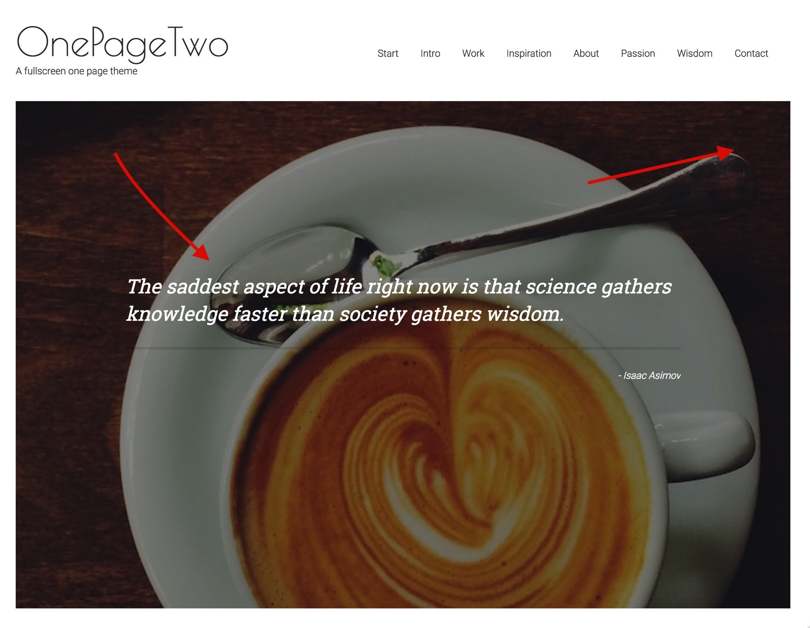

## Second Image Image
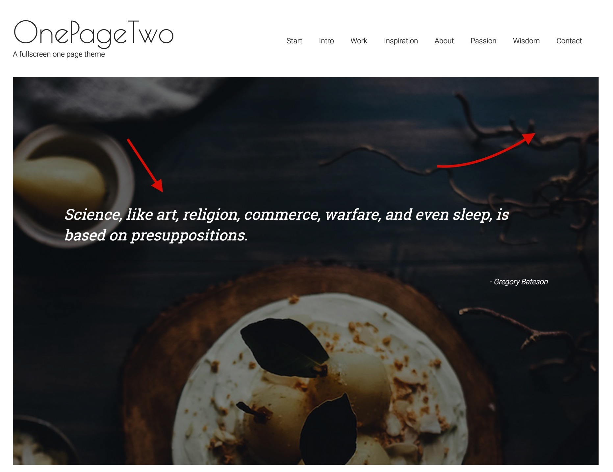

## Quote
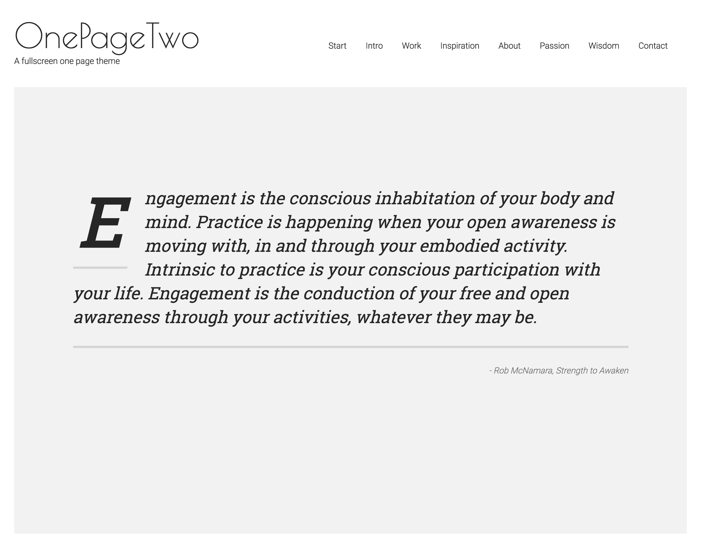

#### Dropcap
The dropcap is created by using the latest version Zen Shortcodes which comes with a new dropcap shortcode.

## Main Content
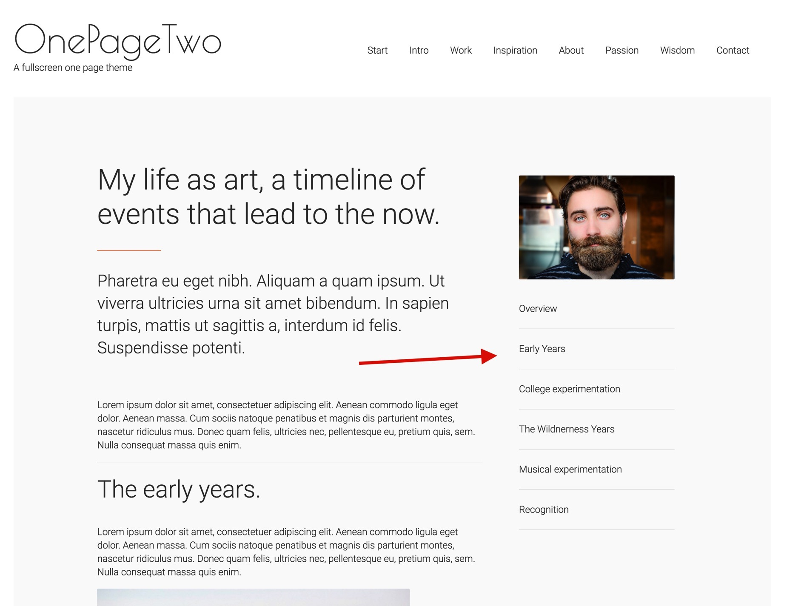

When the user scrolls the content sticks to the top of the browser below the menu
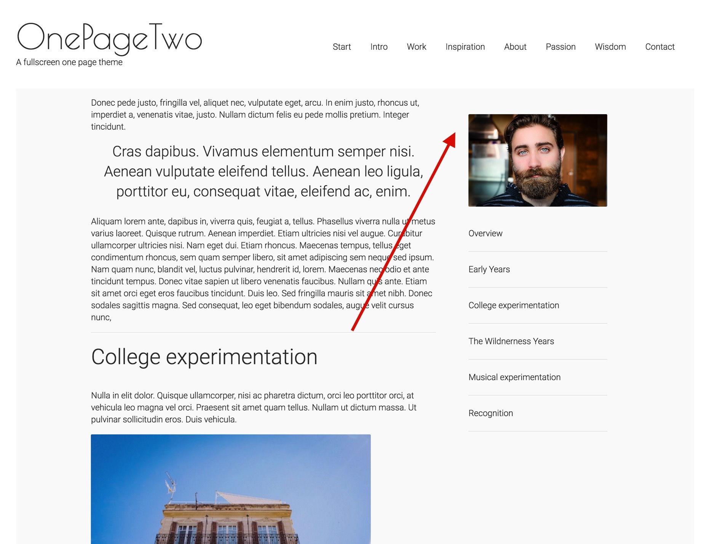

## Parallax

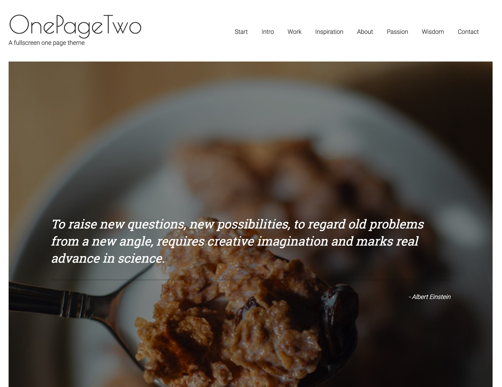

## Bottom quote on dark color

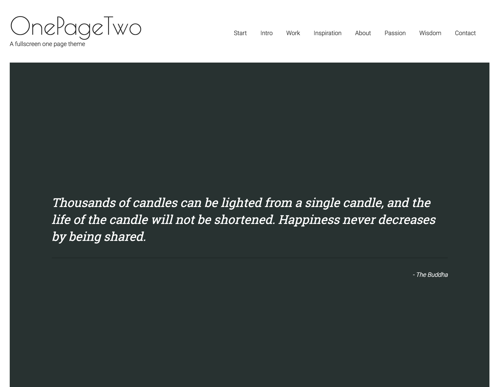

## Contact Form

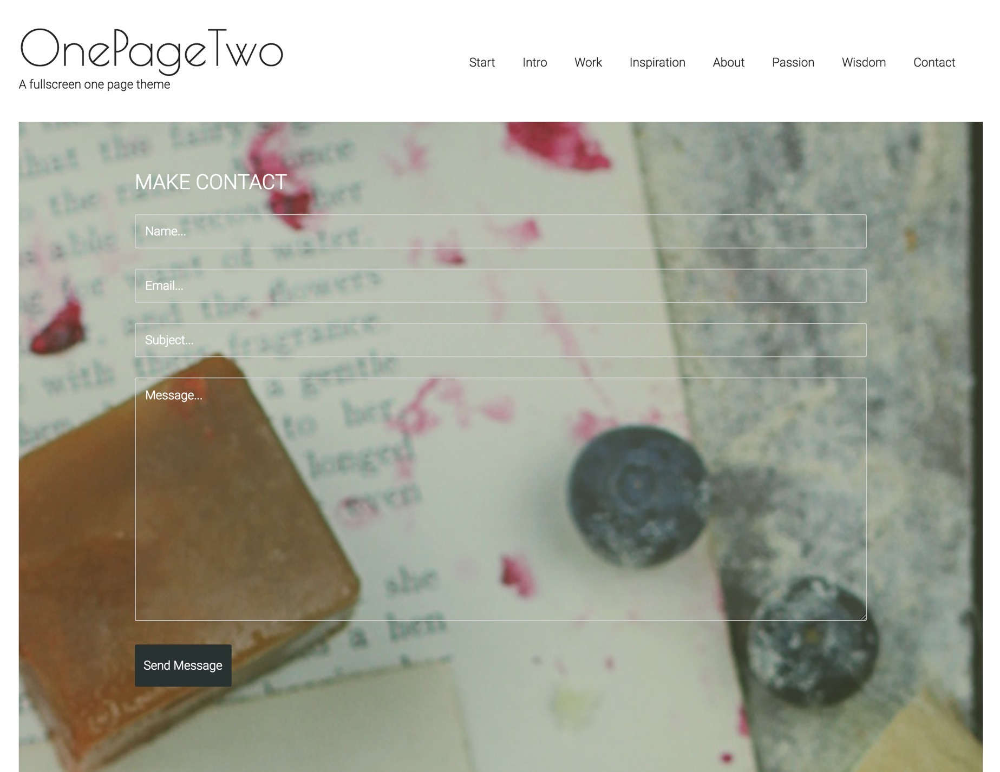

## Social icons

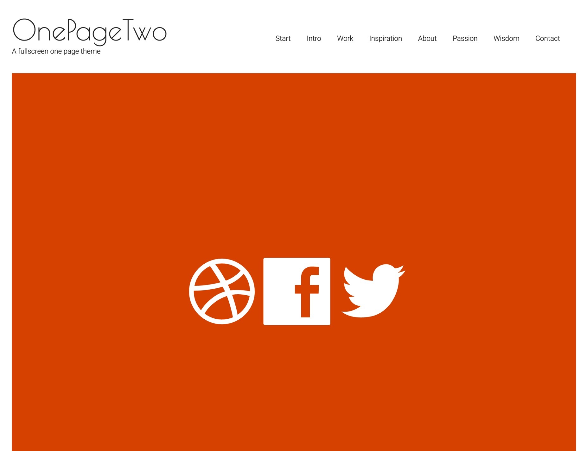

## Footer
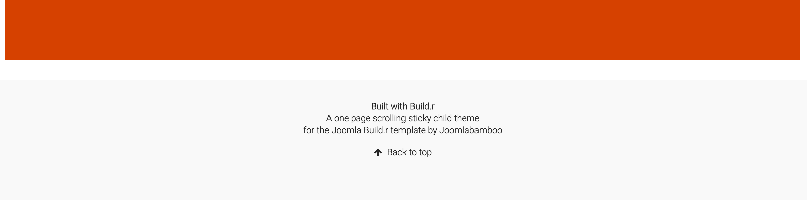

