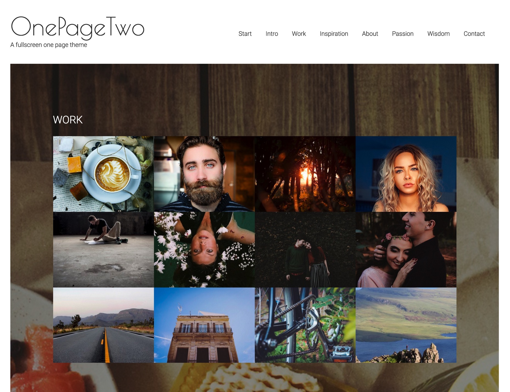
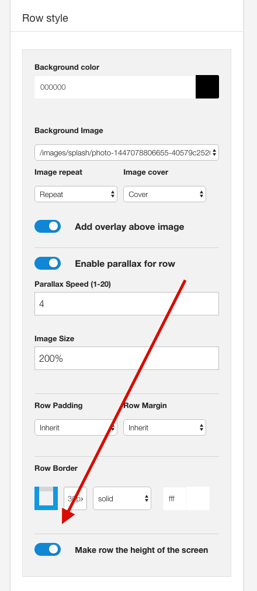
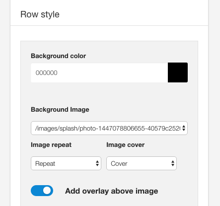

**In Progress**

OnePageTwo2 is a child theme of the Build.r template. This means it uses the Build.r template and applies OnePageTwo2 specific style via Build.r's built in child theme functionality.

## A note about child themes
The files for child themes are located in the templates/buildr/child folder and are selected in the template admin design side panel.  You can read a full explanation of child theming in Build.r <a href="../style/using-child-themes">here</a>.

## Installing OnePageTwo2

The following applies to situations where you have already installed the Buildr template on your site or are installing buildr for the first time.

**Step 1** - Download and install the latest version of the <a href="http://www.joomlabamboo.com/downloads/template-downloads?param=buildr">Buildr template</a>.

**Step 2** - Once installed navigate to the template manager and edit the Buildr template.

**Step 3** - Select the OnePageTwo2 example configuration from the load saved settings dropdown.

After doing this the OnePageTwo2 child theme will be selected and the OnePageTwo2 preset will be set in the preset dropdown list.

Applying the Grid 4 example configuration sets the required theme panel options including the layout blocks used on the demo site in the layout tool.

**Step 4** - Click Save. After clicking save the required assets for the OnePageTwo2 theme will be generated (theme files, css files etc) and will now be available for use on your website.

## Install the OnePageTwo2 quickstart package

If you are starting a new website from scratch we highly recommend installing the OnePageTwo2 quickstart package. This is by far the simplest way to recreate the demo site on your server.

Learn about <a href="http://docs.joomlabamboo.com/getting-started/how-to-install-a-joomla-3-quickstart-package">installing the quickstart package</a>.

## Recreating the OnePageTwo2 demo site

## Description of elements

## Logo

The logo is a custom html module published to the logo position that uses the following markup:

	<h1>OnePageTwo</h1>
	
A fullscreen one page theme

The font used in the logo is a google font called <a href="https://www.google.com/fonts/specimen/Poiret+One">'Poiret One'</a>.

Fonts are controlled in the Build.r template in the General Settings sidepanel

### Notes about the logo position:

- The logo position is placed in the toolbar row in the template design tool. 
- It sits side by side the one page menu block. 
- The toolbar position in the Build.r template is designed to stay at the top of the screen. 
- The vertical and horizontal padding is determined by the settings in the row

## Menu
The menu seen in the demo of the OnePageTwo template is an example of the One Page Menu block.

### Menu Position
The menu can be moved around the layout however for best results it is recommended that the one page menu is added next to the menu block in the toolbar row.

### Menu Content

The content for the menu is determined by two factors:

- Whether there is a title specified in the menu section of the template settings.
- Whether there is a module published to the corresponding row.

If a menu item is not assigned to the row of modules in the template admin then the menu item will not show. However if there is a title assigned in the template settings, but there is no module published to any of the positions assigned to that row then the menu item will also not show.

### Menu Fonts
The font used in the menu is Roboto and it has a font weight of 300.

### Menu Style

The colors used to display the menu can be controlled in the style panel of the general settings side panel. 

## Rows of content with parallax images underneath

The demo site for OnePageTwo features a number of parallax images with quote text that sit on a transparent overlay and move in a parallax behaviour above the image.

This is created using the built in parallax behaviour for the Build.r template, the row background image, the new full screen option and a custom html module using a blockquote.

### Examples

### First Image - Banner row

A custom html module using blockquote syntax published to the banner position.

### Second Image - Grid1 row

A custom html module using blockquote syntax published to the grid1 position.

### Work Module - Grid2 row
The grid of images in this row is an instance of the Zentools2 module displaying 12 images in a grid published to the grid5 position.

### Bottom Image - Grid4 row
A custom html module using blockquote syntax published to the grid13 position.

### How to make the row fill the height of the page.
An addition to the Build.r template in v1.3 is the ability to specify that a given row will fill the height of a row.

The setting is found in the row style panel for any row settings panels.

**This option also adds vertical alignment to the row which ensures that the content always remains vertically positioning in the content area. However it's important to note that the browser screen needs to be taller than 500px and wider than the @phone-max-width value as determined in your template settings.**

On screens that are smaller than these dimensions the height of the row will reset to fill the area determined by the content eg height: auto.

**Please also note** that this option is best suited for rows that have a relatively small amount of content. For rows that have a lot of content it is recommended that you disable this option.

 
 
### Controlling the image assigned to the row

The image that sits underneath the content on these rows is specified in the row settings for each row in the template settings.

**Background Color**
The background color for each row determines the background of the row of content and also the color used in the overlay that sits over the image if that option is enabled.

**Background Image**
The select list in this option is populated with images found in the images folder of your Joomls site.

**Image Repeat**
This option determines whether the background image repeats across the screen.

**Image Cover**
The image cover option determines the background-size parameter for the row. When this option is set to cover the image is used to fill the entire space available in the row. The browser will display the image in the best fit size for the row. The end result of using thsi option will vary according to the aspect ratio fo the image and the amount of space available.

**Add overlay above image** 
This option places a transparent overlay between the background image and the content of the module. The color of the overlay is determined by the background color whereas the opacity for the overlay is determined by the Overlay opacity setting found int he Overlay panel of the General settings sidepanel. The opacity of the overlay is a global value that affects all elements that use this option.

### Controlling the Parallax behaviour

Each row has it's own settings to determine the speed and the size of the image used in the parallax row.

**Enable Parallax for row**.
This option must be enabled in order to trigger the parallax effect.

**Parallax speed**
This option is used to determine the speed at which the image moves in relation to the scrolling behaviour - in general a lower number (faster speed) can be used in this setting for images that are closer to the top of the screen.

**Image Size**
This setting determines the overall size applied to the image. Where 100% equals 100% of the original size of the image. In most cases sizes of 200% and above will ensure that the image always fills the space created by the row.

**Global Parallax settings**
In addition to the above settings there are general parallax settings that affect each instance of the parallax effect on your site. These settings can be found int he general settings side panel in the parallax settings panel.

**Minimum Height**
This option in px, determines the minimum height that is applied to each parallax row.

**Disable below this width**
In some cases you may want to revert the parallax behaviour for smaller screens. This setting allows you to control when the parallax behaviour should be disabled. This should be a px width value.

**Disabled Image size**
This is a percentage value assigned to the image when the screen is below the disabled screen width.

**Revert image to 100%**
In some cases on bery large screens you may like to display the image at 100% of it's size. Use this setting to determine when the image size should be overridden and reset to 100% of the images original size.

## Quote

#### Dropcap
The dropcap is created by using the latest version Zen Shortcodes which comes with a new dropcap shortcode.

## Main Content

When the user scrolls the content sticks to the top of the browser below the menu

## Bottom quote on dark color

## Contact Form

## Social icons

## Footer

