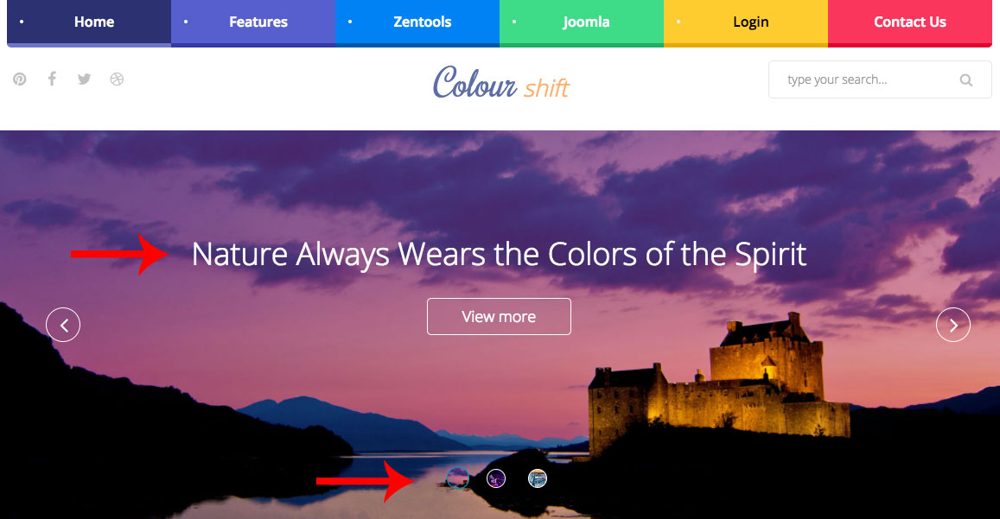

**In Progress**

Colourshift2 is a child theme of the Build.r template. This means it uses the Build.r template and applies Colourshift2 specific style via Build.r's built in child theme functionality.

## A note about child themes
The files for child themes are located in the templates/buildr/child folder and are selected in the template admin design side panel. You can read a full explanation of child theming in Build.r <a href="../style/using-child-themes">here</a>.

Colourshift2 uses child themes for colour variations.

## Installing Colourshift2

The following applies to situations where you have already installed the Buildr template on your site or are installing buildr for the first time.

**Step 1** - Download and install the latest version of the <a href="http://www.joomlabamboo.com/downloads/template-downloads?param=buildr">Buildr template</a>.

**Step 2** - Once installed navigate to the template manager and edit the Buildr template.

**Step 3** - Select Colourshift2 as a preset.

**Step 4** - Select the Colourshift2 example configuration from the load saved settings dropdown.

After doing this the Colourshift2 child theme will be selected and the Colourshift2 preset will be set in the preset dropdown list.

Applying the Colourshift2 example configuration sets the required theme panel options including the layout blocks used on the demo site in the layout tool.

**Step 5** - Click Save. After clicking save the required assets for the Colourshift2 theme will be generated (theme files, css files etc) and will now be available for use on your website.

### Install the Colourshift2 quickstart package

If you are starting a new website from scratch we recommend installing the Colourshift2 quickstart package. This is by far the simplest way to recreate the demo site on your server.

Learn about <a href="http://docs.joomlabamboo.com/getting-started/how-to-install-a-joomla-3-quickstart-package">installing the quickstart package</a>.

## Recreating the Colourshift2 demo site

## Description of elements

## Menu

The menu colours, like you see on the image above, are configurable using special classes via menu settings, in the images below you will be able to see haw it is done.

**POSITION**

Differently

**COLOURS**

First of all select the colours you want to display - you can find all colours <a href="http://bambootheme.com/showcase/sep16/index.php/template-features/module-overview/color-variations" target="_blank">here</a>. After you the select the colour to use, go to your Joomla Administrator area and on the top menu area, go to

`menu > Main Menu > [YOUR MENU]`

Open the Menu Item that you want to change the colour on and click on the tab **Link Type**. You will see a field **Link CSS Style**, just add the desired class to this field and the menu will get the colour you aplied here.

You can do even more here... In case the menu colour you chose is too light, you might want to have the text color to be dark, so you would need to add a complimentary class, that turn the menu text to black.

**Example**

`zen-senary2 zen-menu-text-dark`

You can see this example aplied to **Login** Menu Item on our Colourshift2 demo.

In case you want to make the submenu to have dark color as well, you can use the following class.

`zen-submenu-text-dark`

You can see an example of submenu dark colour on our Colourshift2 demo under menu items **Joomla** and **Login**

## Logo

The logo in the Colourshift2 template uses a custom html module published to the logo position.

The markup used in this position is:

	<h1>Colour shift</h1>

To set the colours, just choose using the editor panel on Buildr. Use the **Logo Hover Colour** option, to set the shift part of the logo.

## Social Icons

The social icons in the top left hand corner are rendered via the template.

### Social icon position
To control the position of the social icons navigate to the design panel in the template settings. The social icons can be placed anywhere in the template layout. The demo features the social icons displayed in the top-right block.

### Social icon content
The content for the social icons can be set in the social panel in the template panel.

### Social Icon appearance

The colour, size and other aspects of the social icon appearance can be controlled via the general settings side panel in the template's design panel.

### Social icons on smaller screens

On the demo when the template is viewed on smaller screens the social icons are no longer displayed on the top left of the screen, but are moved to the bottom.

This is achieved by adding the social-mobile block to the top row.

## Banner slideshow

The slideshow used in the Colourshift2 demo features a new type of slideshow that is not currently available in Zentools2, instead, it is available for Colourshift theme only.

The slideshow is a adapitation of Slideshow Hero and uses additional CSS only available in Colourshift (applied using custom classes in the module).

`colourshift`

The slideshow features a number of options, as per the screenshot below, including:

- Slideshow height
- The content position
- The ability to disable the background image for a slide based on the number in which it appears in the slideshow.
- The ability to add an overlay. The overlay color and opacity is defined in the Zentools2 theme panel.

The demo for Colourshift2 uses the title, introtext and readmore in the main content area and uses Joomla as the content source.

The image is automatically retrieved from the item currently set to display however if the image doesn't exist then the slideshow will display a blank tile which uses the primary color set in the Zentools2 theme panel.

## Colours

The Colourshift2 Template brings a new feature to ZGFv5 (ZenGrid Framework Version 5), this is the abiity to override the .xml files in order to add or remove fields.

In this template, we added an override that adds extra colors, and based on those colours, we can set variations for menu items and modules.

Just go to the Colour section on any item and choose your own colours.

## Modules Class

New Classes was introduced in the Colourshift2 Theme - you can look at these classes in the <a href="http://bambootheme.com/showcase/sep16/index.php/template-features/module-overview/module-classes" target="_blank">Modules Variations</a> Page.

