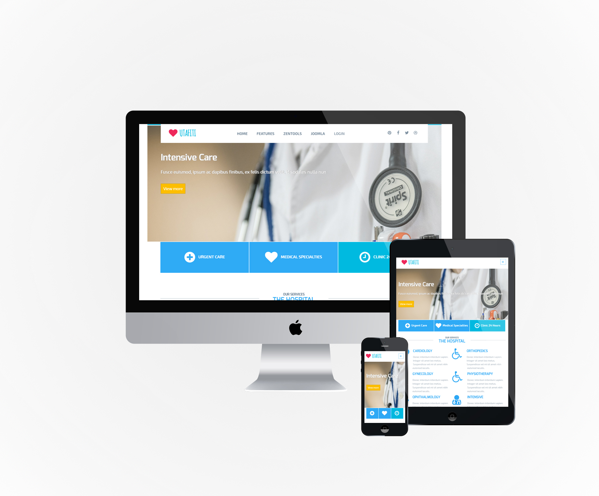
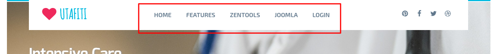
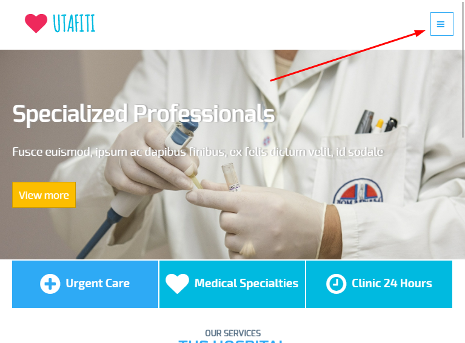
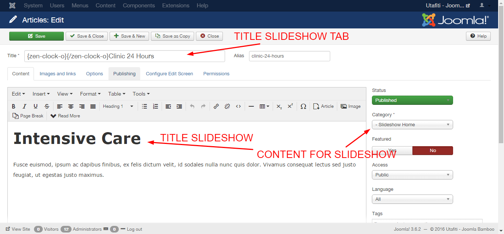

**In Progress**

Utafiti is a child theme of the Buildr template. This means it uses the Build.r template and applies Utafiti specific style via Buildr's built in child theme functionality.

## A note about child themes
The files for child themes are located in the templates/buildr/child folder and are selected in the template admin design side panel.  You can read a full explanation of child theming in Build.r <a href="../style/using-child-themes">here</a>.

## Installing Utafiti

The following applies to situations where you have already installed the Buildr template on your site or are installing buildr for the first time.

**Step 1** - Download and install the latest version of the <a href="http://www.joomlabamboo.com/downloads/template-downloads?param=buildr">Buildr template</a>.

**Step 2** - Once installed navigate to the template manager and edit the Buildr template.

**Step 3** - Select the Utafiti example configuration from the load saved settings dropdown.

After doing this the Utafiti child theme will be selected and the Utafiti preset will be set in the preset dropdown list.

Applying the Utafiti example configuration sets the required theme panel options including the layout blocks used on the demo site in the layout tool.

**Step 4** - Click Save. After clicking save the required assets for the Utafiti theme will be generated (theme files, css files etc) and will now be available for use on your website.

You can customize the template through the theme control panel, according to the image:

## Install the Utafiti quickstart package

If you are starting a new website from scratch we highly recommend installing the Utafiti quickstart package. This is by far the simplest way to recreate the demo site on your server.

Learn about <a href="http://docs.joomlabamboo.com/getting-started/how-to-install-a-joomla-3-quickstart-package">installing the quickstart package</a>.

## Recreating the Utafiti demo site

## Description of elements

## Menu

**The offcanvas menu**

**Collapsed menu**

The configuration of offcanvas menu is controlled according to the following screen in the theme admin panel

**Offcanvas button settings**

The settings used to customize the offcanvas menu are controlled according to the next image.

**Positioning the offcanvas menu**

The offcanvas menu is located according to the image below. It is enabled to access the website on portable devices.

**Please note:** The offcanvas menu will only be activated and viewed when accessing the website from a portable device.

To edit the row settings, click the row icon according to the figure below and then go into the style tab. To copy the settings from the demo, set them according to the next image.

To customize the menus, follow the panel according to the image:

## Logo

The logo in the Utafiti template uses a custom html module published to the logo position.

The markup used in this position is:

	<h1><a href="index.php">{zen-heart}{/zen-heart} UTAFITI</a></h1>

The logo consists of an icon and text. The icon is displayed using syntax from the zen shortcodes plugin. As per the following image:  

Do not forget to create a module for the logo of the mobile version as the image. The other settings are the same as the previous one.

Remember to select all the contents within the text field, and add the link under the picture.

To view the list of Zen Shortcode tags, access path: Features menu> Tools> Zen Shortcode> tab font icons:

To customize the logo, follow the panel according to the image:

## Social Icons

Social icons are at the top and bottom theme

### SOCIAL POSITION TOP

- The position of the top social element is in the logo row, according to the image:

### SOCIAL POSITION BOTTOM

- The position of the bottom social element in this footer row, according to the image:

### Social icon content
The content for the social icons can be set in the social panel in the template panel.

### Social Icon appearance

The color, size and other aspects of the social icon appearance can be controlled via the general settings side panel in the template's design panel.

### Social icons on smaller screens

Accessing the project on small portable devices, you may notice that social icons not displayed at the top. Only at the end of the project, see in the image:

As can be seen in the screenshot above, the social block is designed to be hidden on all screens larger than the phone breakpoint size. The value for the breakpoints can be set in the Layout > Breakpoints section of the General settings side panel.

### Social Icon appearance

The colour, size and other aspects of the social-mobile icon appearance can be controlled via the general settings side panel in the template's design panel.

## Module Banner Slideshow

The slideshow used on the Utafiti demo features a new type of slideshow that was added to Zentools2 in v2.2.6.

The slideshow is called Slideshow Hero and uses some nifty sliding effects when each slide is moved onto the screen. 

The slideshow features a number of options, as per the screenshot below, including:

- Slideshow height
- The content position
- The ability to disable the background image for a slide based on the number in which it appears in the slideshow.
- The ability to add an overlay. The overlay color and opacity is defined in the Zentools2 theme panel.

See the settings screens:

 

See the other settings:

The demo for Utafiti uses the title, introtext and readmore elements in the main content area and uses Joomla as the content source.

The content selection is made according to the image:

The image is automatically retrieved from the item currently set to display however if the image doesn't exist then the slideshow will display a blank tile which uses the primary color set in the Zentools2 theme panel.

To use the Utafiti slideshow style, you need to add a class suffix in the modules advanced settings tab equal to the following (the text must be preceded with a space):

     utafiti-slideshow-hero

## Module OUR SERVICES | THE HOSPITAL

The module configuration in accordance with the image:

- Please note the number of columns! (3)
- Note the use of "||" to separate the module caption title.
- This is the thin module in position grid1.
- Leave module title display enabled

For setting the module items, follow the picture:

 
The content settings are according to the image:

 

The content that is displayed is generated from joomla articles.
For the item's icon, use the zen shortcodes plugin.

For the module to use the Utafiti style, the module class suffix and header class should be as follows (Including preceding spaces), as well as the module style and the head tag select options:

Module class suffix: 

     zen-grid-icons

Header class:

    zen-center zen-line

## Module THE HOSPITAL | KNOW MORE ABOUT US

The module configuration follows the image:

- Note the use of "||" to separate the module caption title.
- This is the thin module in position grid5.
- Leave module title display enabled

For setting the module items, follow the picture:

The content settings are according to the image:

The content, text, title and image. that are displayed are generated from joomla articles.

For the module to use the Utafiti style, the module class suffix and header class should be as follows (Including preceding spaces), as well as the module style and the head tag select options:

Module class suffix: 

     utafiti-know-more

Header class:

    zen-center zen-line

## Module OUR TEAM

The module configuration follows the image:

The content settings are according to the image:

To select more than one category in the 'CONTENT' tab, press CTRL (Windows) or Command (MAC).

For the module to use the Utafiti style, the module class suffix should be as follows (Including preceding space), as well as the module style and the head tag select options:

Module class suffix: 

     utafiti-our-team

The content that is displayed is generated from joomla articles. 

## Module FROM THE BLOG | LATEST NEWS

The module configuration follows the image:

- Note the use of "||" to separate the module caption title.
- This is the thin module in position grid13.
- Leave module title display enabled

The content settings are according to the image:

For the module to use the Utafiti style, the module class suffix and header class should be as follows (Including preceding spaces), as well as the module style and the head tag select options:

Module class suffix: 

     utafiti-lasted-news

Header class:

    zen-center zen-line

The content that is displayed is generated from joomla articles. 

- CONTENT

- IMAGES

- DATE

## Module TESTIMONY PATIENTS

The module configuration follows the image:

- Note the use of "||" to separate the module caption title.
- This is the thin module in position grid17.
- Leave module title display enabled

The content settings are according to the image:

For the module to use the Utafiti style, the module class suffix should be as follows (Including preceding space), as well as the module style select option:

Module class suffix: 

     utafiti-testimony

The content that is displayed is generated from joomla articles.

# FOOTER

The bottom of the site is in accordance with the image.

Attention! For the maps module to work, do not forget to register your API in Google Maps.

# BREADCRUMB

The background used in the breadcrumb is managed by a zentools module. Where you can change the images,

The settings you can see in the images:

