**In Progress**

Highline2 is a child theme of the Build.r template. This means it uses the Build.r template and applies Highline2 specific style via Build.r's built in child theme functionality.

## A note about child themes
The files for child themes are located in the templates/buildr/child folder and are selected in the template admin design side panel.  You can read a full explanation of child theming in Build.r <a href="../style/using-child-themes">here</a>.

## Installing Highline2

The following applies to situations where you have already installed the Buildr template on your site or are installing buildr for the first time.

**Step 1** - Download and install the latest version of the <a href="http://www.joomlabamboo.com/downloads/template-downloads?param=buildr">Buildr template</a>.

**Step 2** - Once installed navigate to the template manager and edit the Buildr template.

**Step 3** - Select the Highline2 example configuration from the load saved settings dropdown.

After doing this the Highline2 child theme will be selected and the Highline2 preset will be set in the preset dropdown list.

Applying the Grid 4 example configuration sets the required theme panel options including the layout blocks used on the demo site in the layout tool.

**Step 4** - Click Save. After clicking save the required assets for the Highline2 theme will be generated (theme files, css files etc) and will now be available for use on your website.

## Install the Highline2 quickstart package

If you are starting a new website from scratch we highly recommend installing the Highline2 quickstart package. This is by far the simplest way to recreate the demo site on your server.

Learn about <a href="http://docs.joomlabamboo.com/getting-started/how-to-install-a-joomla-3-quickstart-package">installing the quickstart package</a>.

## Recreating the Highline2 demo site

## Description of elements

## Menu

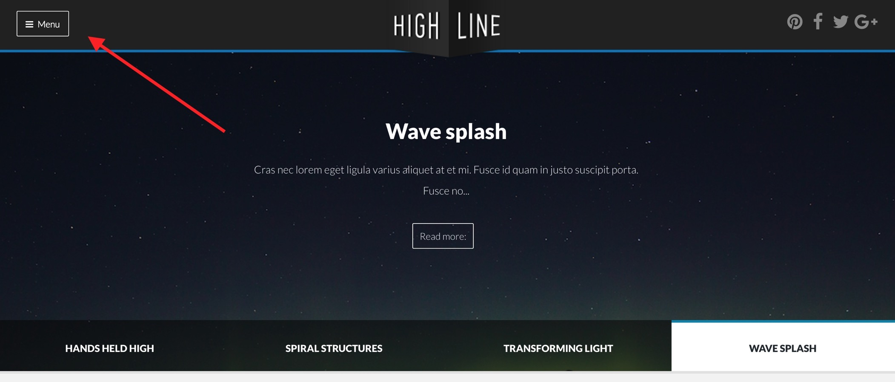

**The expanded menu**

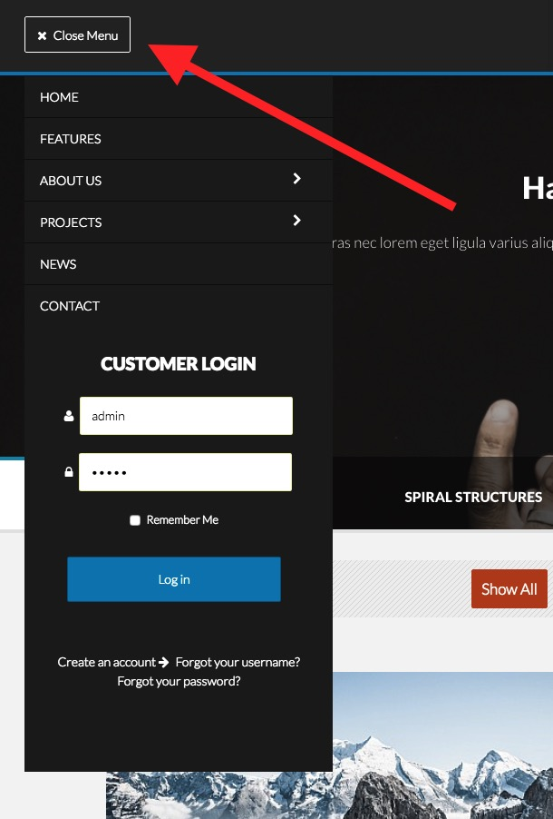

**Collapsed menu**

The Highline2 demo displays the menu in a collapsed state at all screen sizes. This setting is controlled via the nav collapse breakpoint found in the templates layout sidepanel.

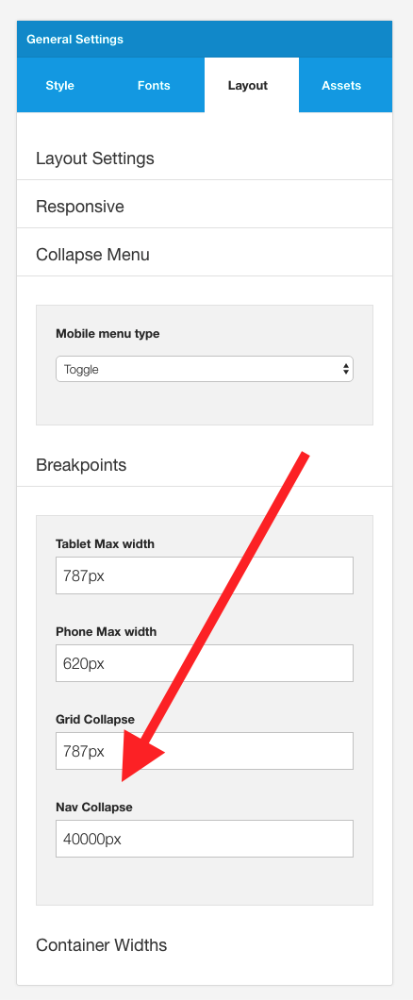

The type of collapsed menu used is determined by the mobile menu type option. The toggle menu or off canvas menu are ideal for use in the Highline2 template.

**Toggle button settings**

The text used for the toggle menu button and the text used to close the menu when it is open is controlled via the menu panel in the template settings. The style of the button used is also controlled in this area of the template settings.

**Positioning the toggle trigger**

The toggle menu is displayed in the template layout when the toggle-menu layout block is dragged into the layout. The Highline2 child theme places the toggle-menu block int he top-left block in the layout area.

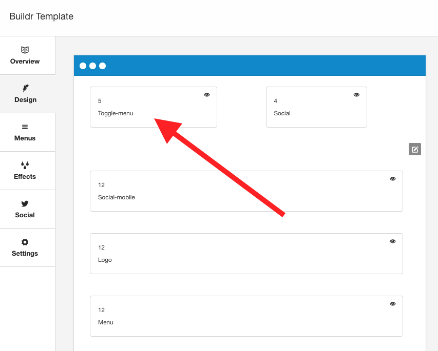

**Please note:** The menu block also needs to be in the layout area for the toggle menu to work in this instance.

The top left row uses the following settings:

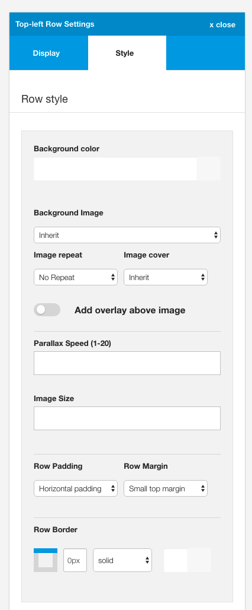

## Logo

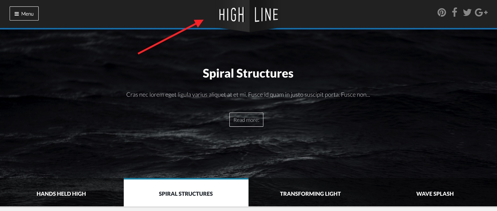

The logo in the Highline2 template uses a custom html module published to the logo position.

The markup used in this position is:

	

To create the correct positioning the module uses the following module class suffix:

	minusbottom60 minustop30

- minusbottom60: moves the content below the logo up by 60px.
- minustop30: moves the logo module up 30px

## Social Icons

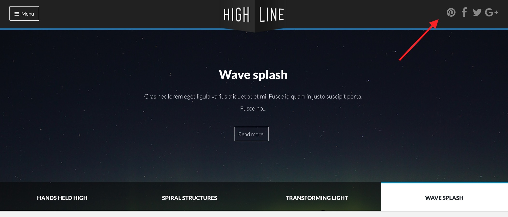

The social icons in the top right hand corner are rendered via the template.

### Social icon position
To control the position of the social icons navigate to the design panel in the template settings. The social icons can be placed anywhere in the template layout. The demo features the social icons displayed in the top-right block.

### Social icon content
The content for the social icons can be set in the social panel in the template panel.

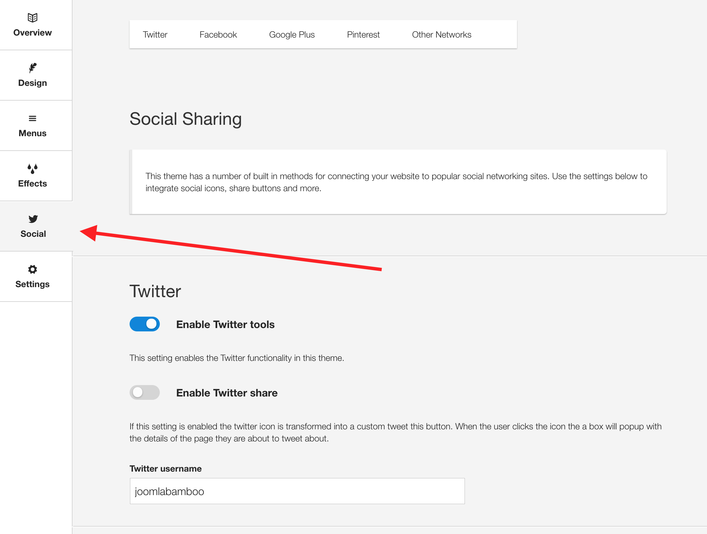

### Social Icon appearance

The color, size and other aspects of the social icon appearance can be controlled via the general settings side panel in the template's design panel.

### Social icons on smaller screens

On the demo when the template is viewed on smaller screens you will have noticed that the social icons are no longer displayed on the top right of the screen, but are moved below the logo in a white row that stretches across the screen.

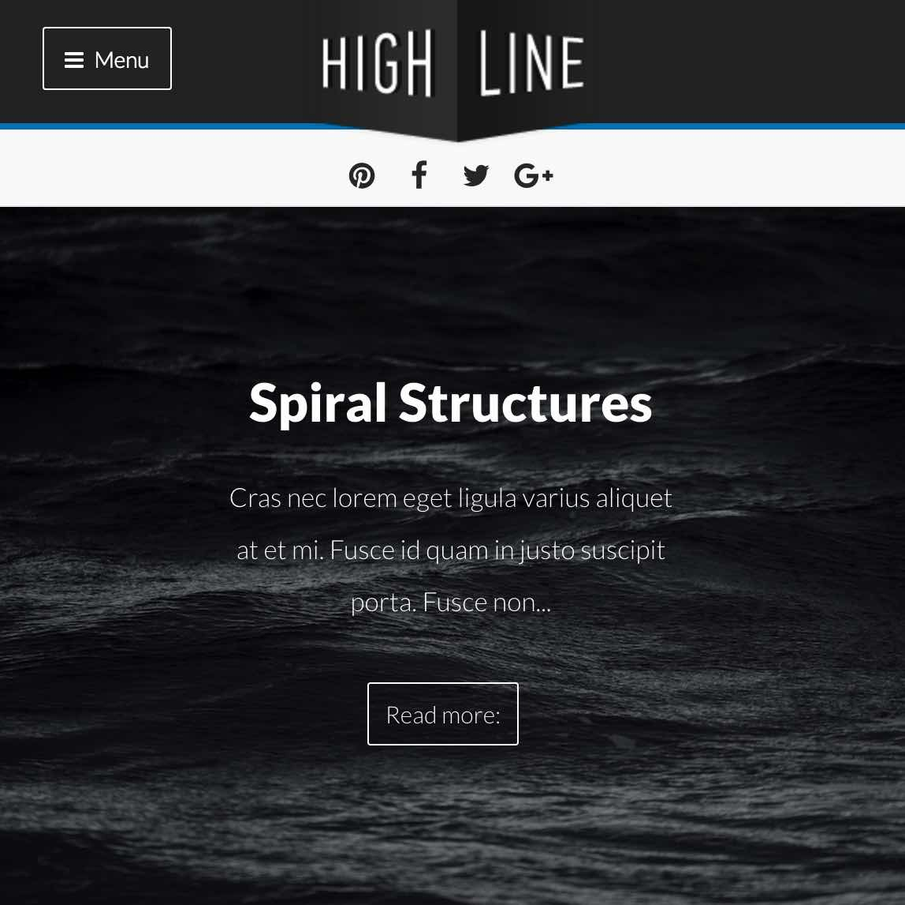

This is achieved by adding the social-mobile block to the top row.

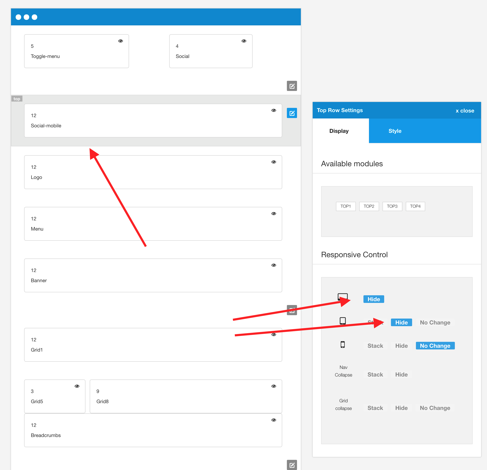

As can be seen in the screenshot above, the social block is designed to be hidden on all screens larger than the phone breakpoint size. The value for the breakpoints can be set in the Layout > Breakpoints section of the General settings side panel.

### Social Icon appearance

The color, size and other aspects of the social-mobile icon appearance can be controlled via the general settings side panel in the template's design panel.

## Banner slideshow

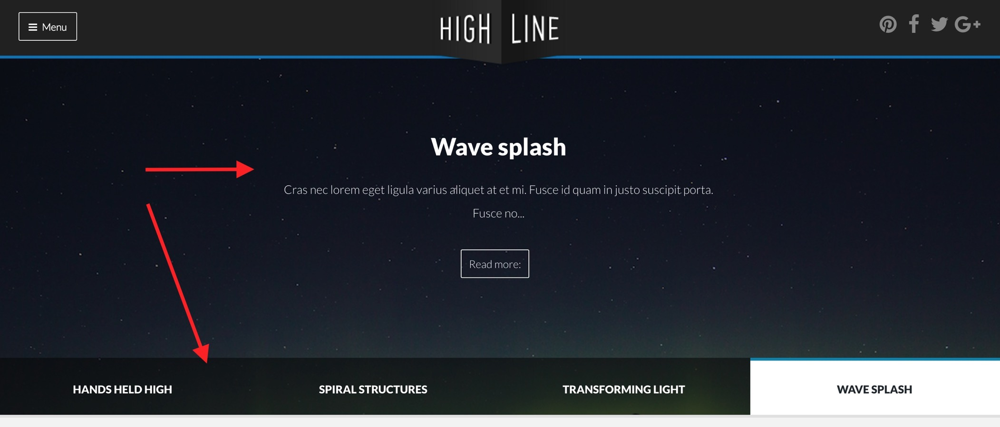

The slideshow used in the Highline2 demo features a new type of slideshow that was added to Zentools2 in v2.2.6.

The slideshow is called Slideshow Hero and uses some nifty sliding effects when each slide is moved onto the screen. 

The slideshow features a number of options, as per the screenshot below, including:

- Slideshow height
- The content position
- The ability to disable the background image for a slide based on the number in which it appears in the slideshow.
- The ability to add an overlay. The overlay color and opacity is defined in the Zentools2 theme panel.

The demo for Highline2 uses the title, introtext and readmore in the main content area and uses Joomla as the content source.

The image is automatically retrieved from the item currently set to display however if the image doesn't exist then the slideshow will display a blank tile which uses the primary color set in the Zentools2 theme panel.

## Zentools2 Isotope - A selection of our work

The area below the slideshow is a Zentools2 module published to the grid1 position. It uses the Isotope layout which provides the ability to add filters to the layout and also display the content items in a flexible jigsaw grid.

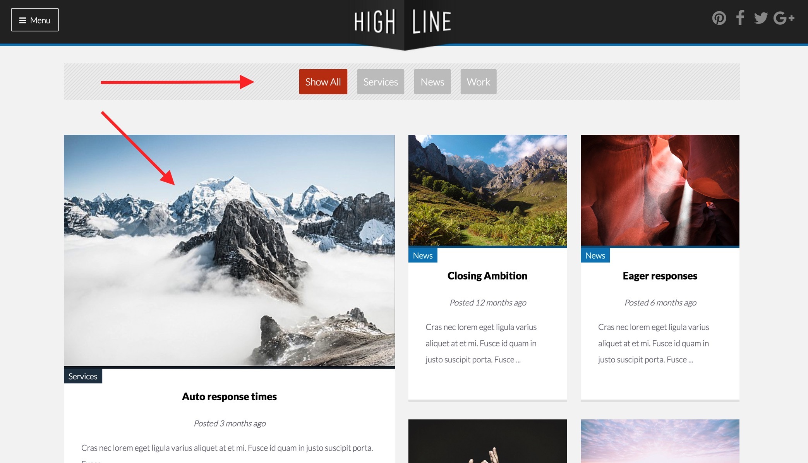

The module uses Joomla as a content source and uses the tags:
- image
- readmore
- category
- title
- time since
- introtext

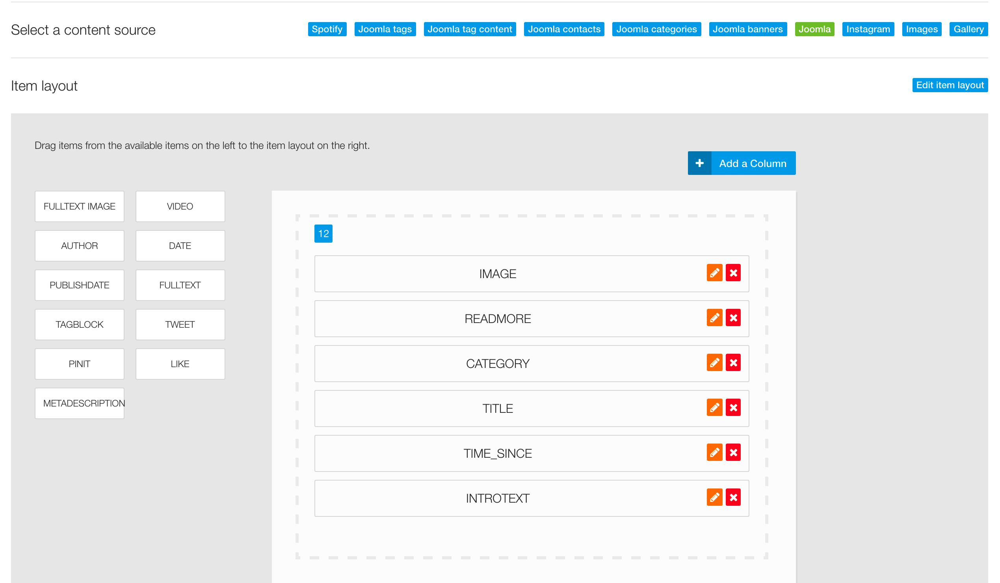

The module uses the "overlay-category" module class to position the category above the image.
 
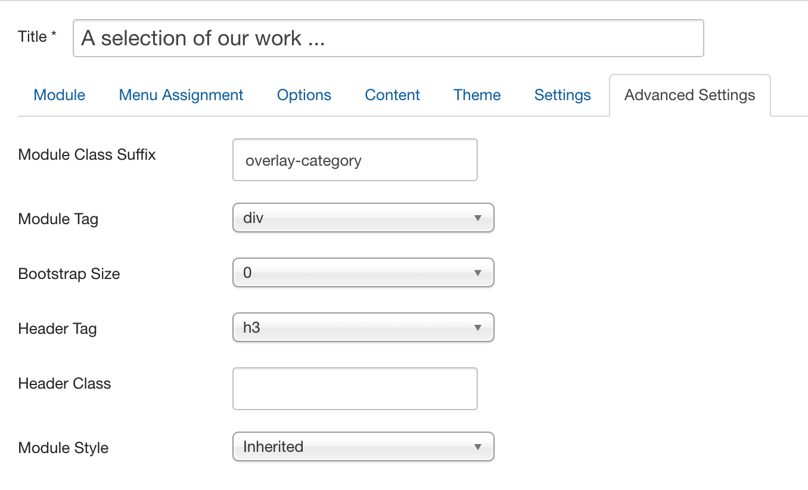

### Featured items

The isotope layout makes it possible for you to differentiate your featured / non-featured content. Any item in the layout that is featured receives the featured class.

The width of featured items is determined in the Zentools2 theme panel. The screenshot below displays one of the featured items int he layout.

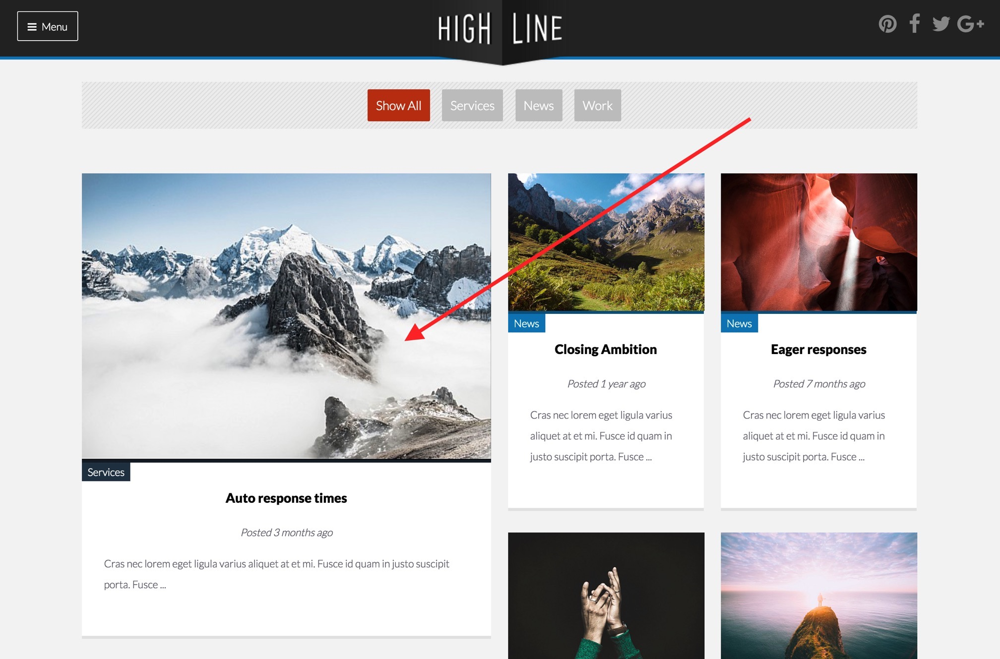

Most content sources available to Zentools2 allow the displaying of featured content. The screenshot below displays a featured item in the Joomla content manager.

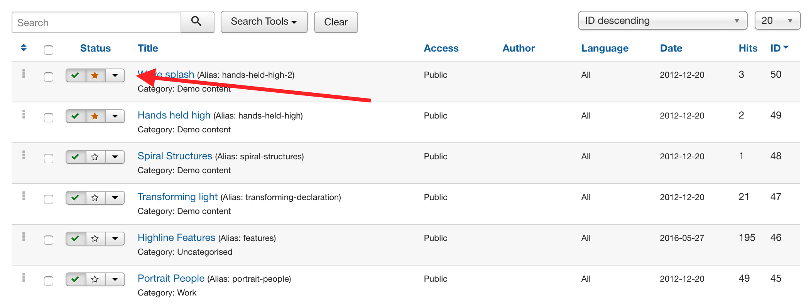

The isotope layout inherits the settings set in the masonry area of the Zentools2 theme panel. The demo site uses the settings shown in the screenshot below.

Determining the correct values to use here will require a degree of trial and error. The optimum widths will depend on which items in the layout are featured and where they appear in the output of the module.

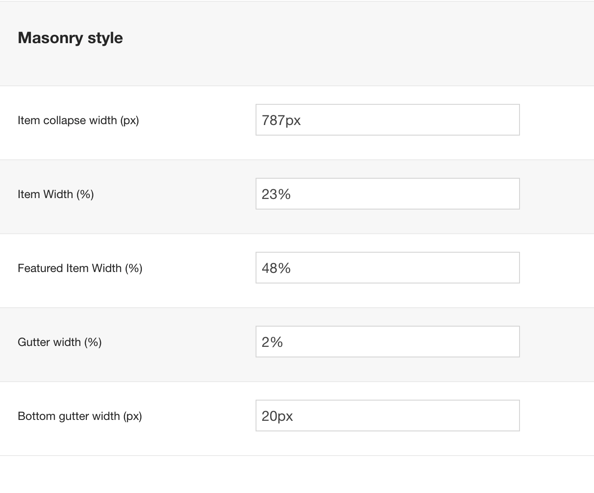

## 9 square grid and quote

The row below the isotope area is a combination of two modules that include a custom html module which contains a blockquote. 

### Blockquote
You can see the markup used in the blockquote below. The blockquote module is published to the grid13 module position.

	<blockquote>Lorem ipsum dolor sit amet, consectetur adipiscing elit. Vestibulum eu maximus massa. Etiam id tempor sapien. Cras aliquam erat id urna placerat consectetur. Curabitur tincidunt, elit at viverra consectetur, urna velit convallis libero, id tristique quam lorem ut elit. Donec feugiat nulla ac urna tincidunt, vulputate faucibus massa lobortis.</blockquote>
	
<a class="btn btn-primary btn-empty" href="#">See More</a>

### 9 Square grid

The grid of images is an instance of the Zentools2 module published to the grid16 position.

It uses the caption layout and images from a folder as the content source.

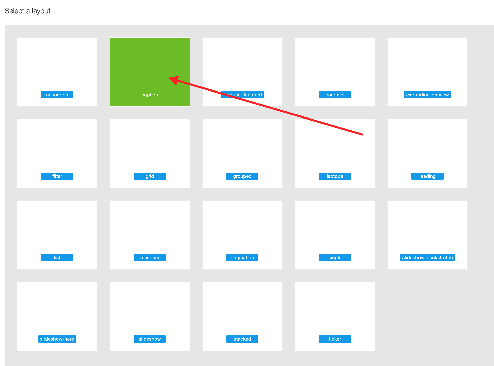

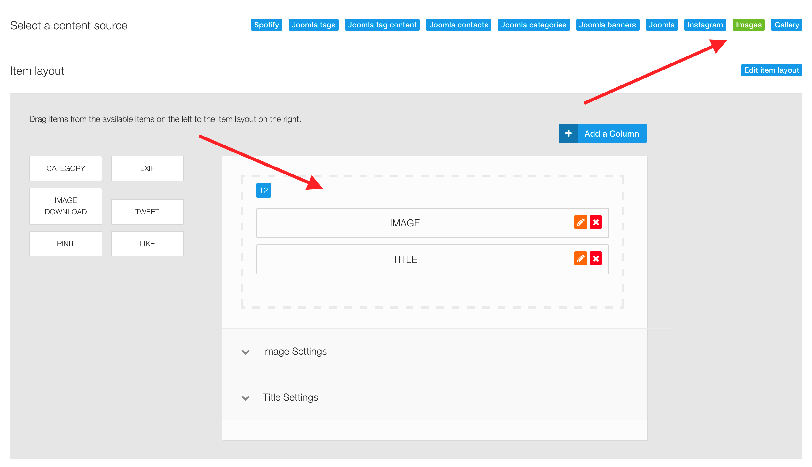

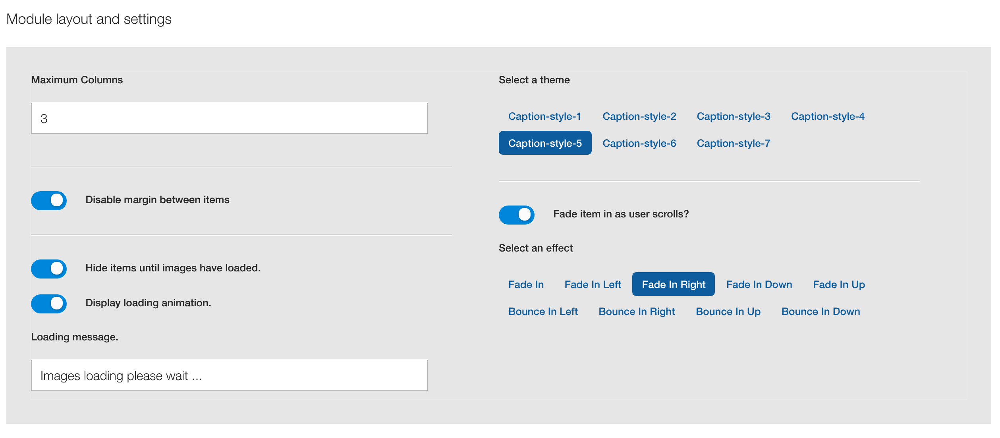

### Template settings for this row.

The blue colour underneath the block quote is controlled via the row background setting in for the grid4 row.

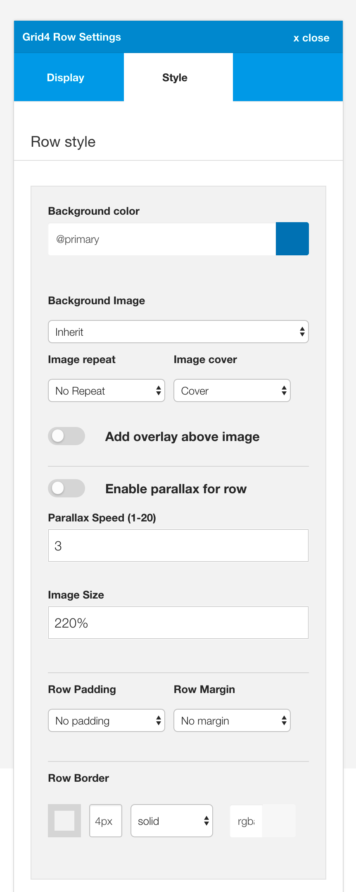

The content of the row is set to display the fullwidth of the screen. This setting is toggled on and off in the container settings panels.

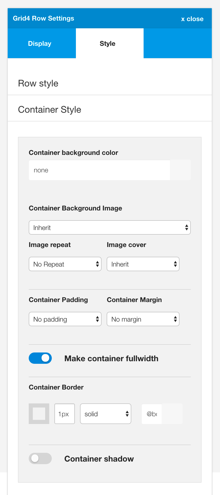
