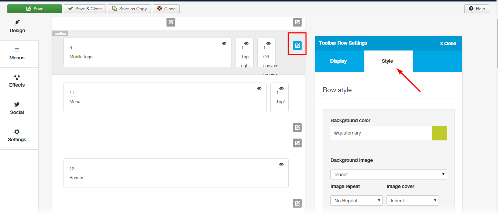
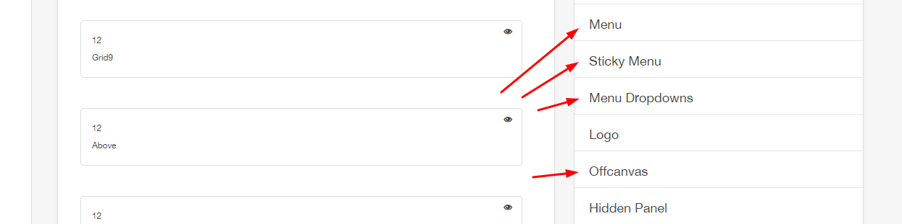
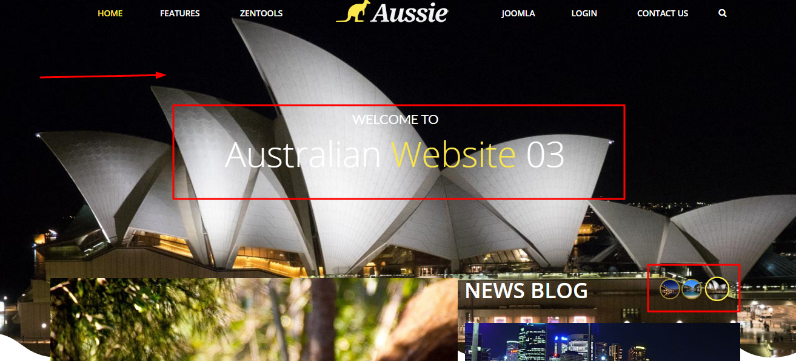
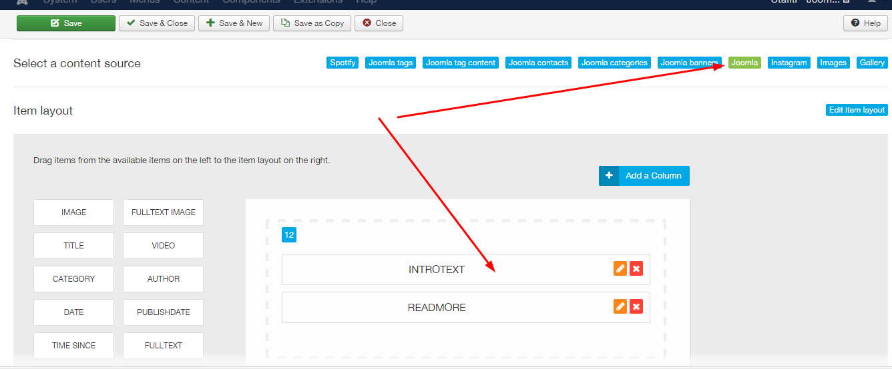
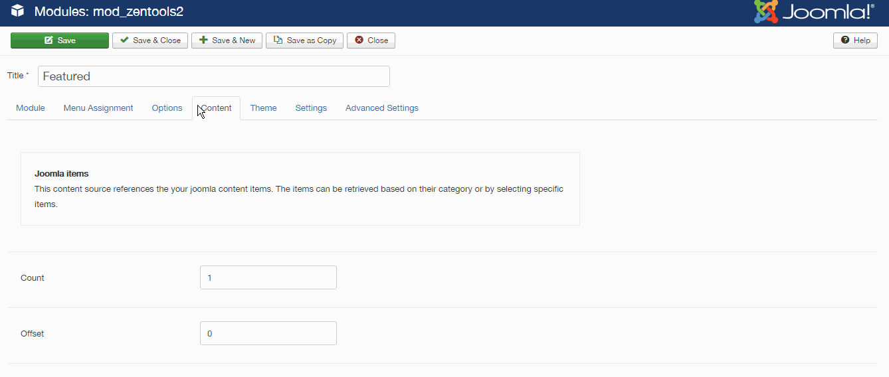
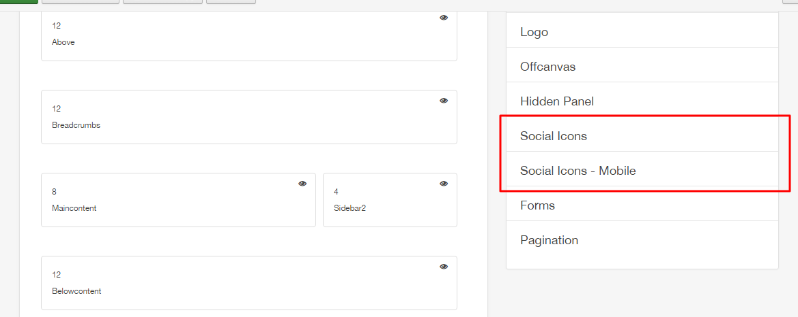
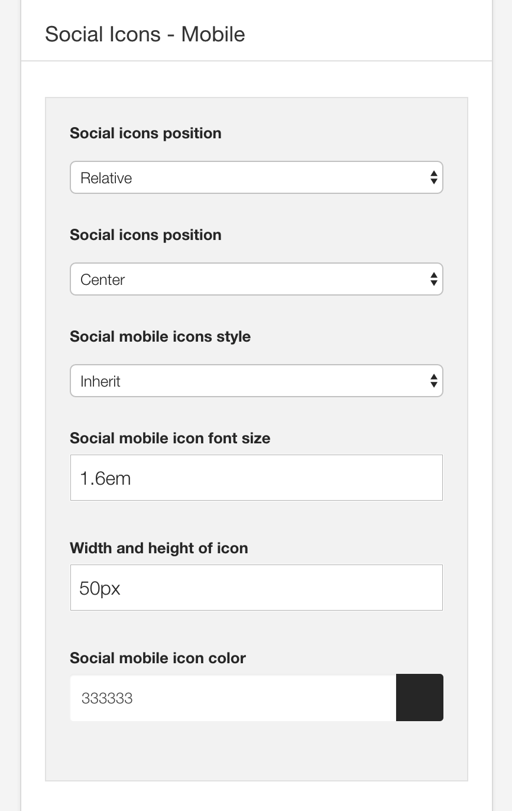

**In Progress**

Aussie is a child theme of the Buildr template. This means it uses the Build.r template and applies Aussie specific style via Buildr's built in child theme functionality.

## A note about child themes
The files for child themes are located in the templates/buildr/child folder and are selected in the template admin design side panel.  You can read a full explanation of child theming in Build.r <a href="../style/using-child-themes">here</a>.

## Installing Aussie

The following applies to situations where you have already installed the Buildr template on your site or are installing buildr for the first time.

**Step 1** - Download and install the latest version of the <a href="http://www.joomlabamboo.com/downloads/template-downloads?param=buildr">Buildr template</a>.

**Step 2** - Once installed navigate to the template manager and edit the Buildr template.

**Step 3** - Select the Aussie example configuration from the load saved settings dropdown.

After doing this the Aussie child theme will be selected and the Aussie preset will be set in the preset dropdown list.

Applying the Aussie example configuration sets the required theme panel options including the layout blocks used on the demo site in the layout tool.

**Step 4** - Click Save. After clicking save the required assets for the Aussie theme will be generated (theme files, css files etc) and will now be available for use on your website.

You can customize the template through the theme control panel, according to the image:

## Install the Aussie quickstart package

If you are starting a new website from scratch we highly recommend installing the Aussie quickstart package. This is by far the simplest way to recreate the demo site on your server.

Learn about <a href="http://docs.joomlabamboo.com/getting-started/how-to-install-a-joomla-3-quickstart-package">installing the quickstart package</a>.

## Recreating the Aussie demo site

## Description of elements

## Menu

The Aussie theme has two versions of the menu layout, configured as follows:

**1 -** The first version is MENU >> LOGO >> MENU >> SEARCH 

**2 -** The second version consists of MENU >> SEARCH >> LOGO (below)

To configure the menus you need to configure the following:

- Select the type of layout you want from the themes menu, according to the image below:

- It is also necessary to select the type of menu you want by default, according to the image below

Within each menu, you need to enter these classes:

**Menu Default**

**Menu Alternative**

**The offcanvas menu**

**Collapsed menu**

The configuration of offcanvas menu is controlled according to the following screen in the theme admin panel

**Offcanvas button settings**

The settings used to customize the offcanvas menu are controlled according to the next image.

**Positioning the offcanvas menu**

The offcanvas menu is located according to the image below. It is enabled to access the website on portable devices.

**Please note:** The offcanvas menu will only be activated and viewed when accessing the website from a portable device.

To edit the row settings, click the row icon according to the figure below and then go into the style tab. To copy the settings from the demo, set them according to the next image.

To customize the menus, follow the panel according to the image:

## Logo

The logo in the Aussie template uses a custom html module published to the logo position.

The logo is presented in two forms, one for each menu:

**1 -** Menu default - With the default menu, the logo is used as the image

	<h1></h1>
	

**2 -** Menu alternative - With the alternative menu, the logo is used as html

	<h1><a href="index.php">{zen-joomla}{/zen-joomla} Aussie</a></h1>

The logo consists of an icon and text. The icon is displayed using syntax from the zen shortcodes plugin. As per the following image:  

Disable this option so only the alternate logo is displayed!

Do not forget to create a module for the logo of the mobile version as the image. The other settings are the same as the previous one.

Remember to select all the contents within the text field, and add the link under the picture.

To view the list of Zen Shortcode tags, access path: Features menu> Tools > Zen Shortcode> tab font icons:

To customize the logo, follow the panel according to the image:

## Module Banner Slideshow

To configure the top slideshow, see the illustration below:

 

See the settings screens:

 

Slideshow items use standard joomla articles:

The content selection is made according to the image:

The image is automatically retrieved from the item currently set to display however if the image doesn't exist then the slideshow will display a blank tile which uses the primary color set in the Zentools2 theme panel.

To use the Aussie slideshow style, you need to add a class suffix in the modules advanced settings tab equal to the following:

     aussie-slideshow wave-border

 

## Module NEWS BLOG

This part is composed of two modules in the same position:

- Featured: Controls left-side images 

- News Blog: Controls right-side images 

** - Featured**

The module configuration in accordance with the image:

- Please note the number of columns! (1)
- This is the thin module in position grid8.
- Leave module title display disabled.

For setting the module items, follow the picture:

 
The content settings are according to the image:

 

The content that is displayed is generated from joomla articles.

 

 

 

For the Featured module assume the style of the Aussuie theme, do not forget to use it, according to the image below

Module class suffix: 

     aussie-featured

** - News Blog**

The module configuration in accordance with the image:

- Please note the number of columns! (1)
- This is the thin module in position grid8.
- Leave module title display enable.

For setting the module items, follow the picture:

 

The content that is displayed is generated from joomla articles.

 

 

 

For the Featured module assume the style of the Aussuie theme, do not forget to use it, according to the image below

Module class suffix: 

     aussie-news

## Module NEWS BLOG 2

The module configuration follows the image:

For the other  setting the module items, follow the picture:

 

- This is the thin module in position grid8.
- Leave module title display disabled

The content that is displayed is generated from joomla articles.

 

 

 

For the News Blog 2 module assume the style of the Aussuie theme, do not forget to use it module class sulfix, according to the image below

Module class suffix: 

     aussie-more

## Module ATTRACTIONS

The module configuration follows the image:

For the other  setting the module items, follow the picture:

- This is the thin module in position grid5.
- Leave module title display enabled

The content settings are according to the image:

The content that is displayed is generated from joomla articles.

 

To select more than one category in the 'CONTENT' tab, press CTRL (Windows) or Command (MAC).

For the Attractions module assume the style of the Aussuie theme, be sure to use class sulfix module, according to the image below

Module class suffix: 

     aussie-slide

## Module ABOUT

The module configuration follows the image:

For the other  setting the module items, follow the picture:

- This is the thin module in position grid9.
- Leave module title display enabled

The content that is displayed is generated from joomla articles.

 

## Module MENU

This menu is positioned on the bottom row, in the  position bottom 1:

This menu is linked to the menu Footer Menu

## Module NEWSLETTER

This menu is positioned on the bottom row, in the  position bottom 2:

Attention! This module is only an illustrative version of a newsletter module, without any effective action. If you want, you need to install a newsletter module for this

## Social Icons

The social icons are located in the bottom position of the theme.

### SOCIAL POSITION BOTTOM

- The social icons position is within the bottom line, according to the image:

### Social icon content
The content for the social icons can be set in the social panel in the template panel.

### Social Icon appearance

The color, size and other aspects of the social icon appearance can be controlled via the general settings side panel in the template's design panel.

### Social icons on smaller screens

Accessing the project in portable devices, social icons are like the image:

As can be seen in the screenshot above, the social block is designed to be hidden on all screens larger than the phone breakpoint size. The value for the breakpoints can be set in the Layout > Breakpoints section of the General settings side panel.

### Social Icon appearance

The colour, size and other aspects of the social-mobile icon appearance can be controlled via the general settings side panel in the template's design panel.

# SINGLE CONTACT (MAP)

The background used in the breadcrumb is managed by a JB Maps2 module. Where you can change the images,

The settings you can see in the images:

- This is the thin module in position banner.
- Leave module title display disabled.
- Do not forget to insert class suffix "nomargin" (no space before).