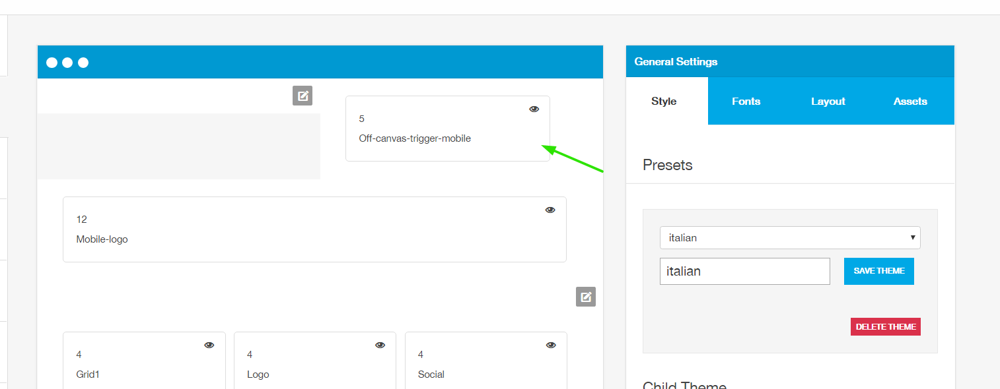
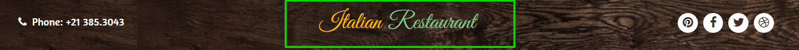
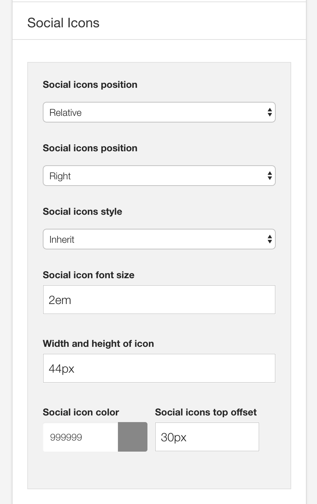

**In Progress**

Italian is a child theme of the Buildr template. This means it uses the Build.r template and applies Italian specific style via Buildr's built in child theme functionality.

## A note about child themes
The files for child themes are located in the templates/buildr/child folder and are selected in the template admin design side panel.  You can read a full explanation of child theming in Build.r <a href="../style/using-child-themes">here</a>.

## Installing Italian

The following applies to situations where you have already installed the Buildr template on your site or are installing buildr for the first time.

**Step 1** - Download and install the latest version of the <a href="http://www.joomlabamboo.com/downloads/template-downloads?param=buildr">Buildr template</a>.

**Step 2** - Once installed navigate to the template manager and edit the Buildr template.

**Step 3** - Select the Italian example configuration from the load saved settings dropdown.

After doing this the Italian child theme will be selected and the Italian preset will be set in the preset dropdown list.

Applying the Italian example configuration sets the required theme panel options including the layout blocks used on the demo site in the layout tool.

**Step 4** - Click Save. After clicking save the required assets for the Italian theme will be generated (theme files, css files etc) and will now be available for use on your website.

You can customise the template through the theme control panel, according to the image:

## Install the Italian quickstart package

If you are starting a new website from scratch we highly recommend installing the Italian quickstart package. This is by far the simplest way to recreate the demo site on your server.

Learn about <a href="http://docs.joomlabamboo.com/getting-started/how-to-install-a-joomla-3-quickstart-package">installing the quickstart package</a>.

## Recreating the Italian demo site

## Description of elements

## Menu

**The offcanvas menu**

**Collapsed menu**

The configuration of offcanvas menu is controlled according to the following screen in the theme admin panel

**Offcanvas button settings**

The settings used to customize the offcanvas menu are controlled according to the next image.

**Positioning the offcanvas menu**

The offcanvas menu is located according to the image below. It is enabled to access the website on portable devices.

**Please note:** The offcanvas menu will only be activated and viewed when accessing the website from a portable device.

To edit the row settings, click the row icon according to the figure below and then go into the style tab. To copy the settings from the demo, set them according to the next image.

To customize the menus, follow the panel according to the image:

## Logo

The logo in the Utafiti template uses a custom html module published to the logo position.

The markup used in this position is:

	<h1><a href="index.php">Italian Restaurant</a></h1>
	

Do not forget to create a module for the logo of the mobile version as the image. The other settings are the same as the previous one.

Remember to select all the contents within the text field, and add the link under the picture.

## Contact 

This module displays a contact phone made with a custom html (icon + text)

To view the list of Zen Shortcode tags, access path: Features menu> Tools > Zen Shortcode> tab font icons:

## Social Icons

The social icons are located in the top-right position of the theme.

### SOCIAL POSITION TOP-RIGHT

- The social icons position is within the logo line, according to the image:

### Social icon content
The content for the social icons can be set in the social panel in the template panel.

### Social Icon appearance

The color, size and other aspects of the social icon appearance can be controlled via the general settings side panel in the template's design panel.

These icons in top-right position are hidden when accessed on smartphones and others devices.

### SOCIAL POSITION COPYRIGHT

- This is the thin module in position copyright.
- Leave module title display desabled.

To configure the top slideshow, see the illustration below:

For the Featured module assume the style of the Italian theme, do not forget to use it, according to the image below

Module class suffix: 

      zencenter
	  
	  

### Social icons on smaller screens

Accessing the project in portable devices, social icons are like the image:

As can be seen in the screenshot above, the social block is designed to be hidden on all screens larger than the phone breakpoint size. The value for the breakpoints can be set in the Layout > Breakpoints section of the General settings side panel.

### Social Icon appearance

The colour, size and other aspects of the social-mobile icon appearance can be controlled via the general settings side panel in the template's design panel.

## Module Banner Slideshow

To configure the top slideshow, see the illustration below:

 

Slideshow items use standard joomla articles:

The content selection is made according to the image:

 

## Module Our Menu Specialities

The module configuration in accordance with the image:

- Please note the number of columns! (3)
- This is the thin module in position grid5.
- Leave module title display enabled.

The content selection is made according to the image:

 

The content that is displayed is generated from joomla articles.

 

 

For the Featured module assume the style of the Italian theme, do not forget to use it, according to the image below

Module class suffix: 

     zen-centered

## Module About The Company

The module configuration in accordance with the image:

- This is the thin module in position grid9.
- Leave module title display enabled.

The content selection is made according to the image:

 

The content that is displayed is generated from joomla articles.

 

 

For the Featured module assume the style of the Italian theme, do not forget to use it, according to the image below:

Module class suffix: 

     icon

 

## Module People Talk About Us

This module is constituted with a module Custom HTML (1º) and another module zentools (2º).

1º -The module configuration follows the image:

- This is the thin module in position grid13.
- Leave module title display desabled.

2º -The module configuration follows the image:

- This is the thin module in position grid14.
- Leave module title display desabled.

The content selection is made according to the image:

 

The content that is displayed is generated from joomla articles.

 

 

## Module Menu Footer

This is type module menu in position footer with title enabled.

## Module Copyright Address

This is type module custom in position copyright with title enabled.

## Module Sample Menu

The module configuration in accordance with the image:

- This is formed by two modules in position grid-example-1 called in an article through the tag {loadposition) within an article. 

- Leave the modules with title enabled.

The modules  Starters and Mains following the same configuration.

The content selection is made according to the image:

 

The content that is displayed is generated from joomla articles.

 

 

For the Featured module assume the style of the Italian theme, do not forget to use it, according to the image below:

Module class suffix: 

      menuContent

## Module Restaurant Map

The background used in page Single Contact is managed by a JB Maps2 module. Where you can change the images,

The settings you can see in the images:

- This is the thin module in position grid17.
- Leave module title display disabled.
