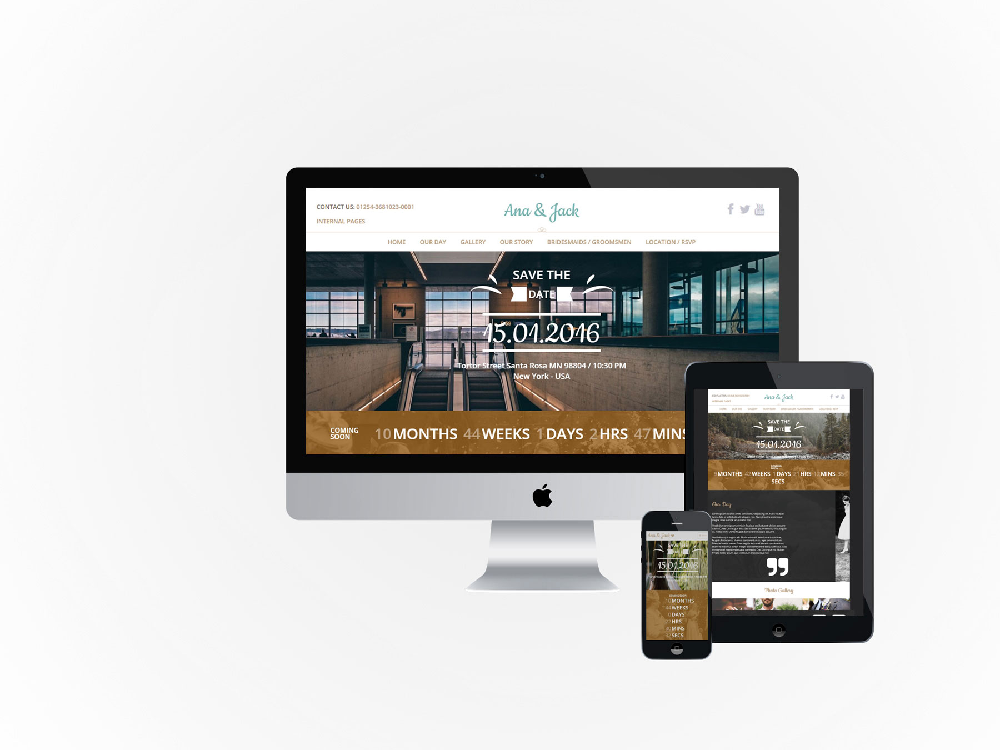

**In Progress**

 

## Wedding is a child theme

Wedding is a child theme of the Build.r template. This means it uses the Build.r template and applies Wedding specific styling via Build.r's built in child theme functionality.


## A note about child themes

The files for child themes are located in the templates/buildr/child folder and are selected in the template admin design side panel. You can read a full explanation of child theming in Build.r [here](http://docs.joomlabamboo.com/joomla-template/buildr-documentation/style/using-child-themes).

## Installing

**Step 1** - Download, install and enable the latest Zen Grid Framework 5 plugin.

**Step 2** - Download and install the latest version of the Buildr - Wedding template.

**Step 3** - Enable the Buildr / Wedding template as the default template in the template manager.

**Step 4** – Open the template and select the Wedding configuration from the presets dropdown (this will load the prest used on the home page). 

**Step 5** – In the section below Presets called Child Theme check Wedding is selected as the child theme. 

**Step 6** - Click Save. After clicking save the required assets for Wedding theme will be generated (theme files, css files etc) and will now be available for use on your website. 

## Install the Wedding quickstart package

If you are starting a new website from scratch we highly recommend installing the Wedding quickstart package. This is by far the simplest way to recreate the demo site on your server. 
[Learn about installing the quickstart package](http://docs.joomlabamboo.com/getting-started/how-to-install-a-joomla-3-quickstart-package).

## Adding a module class

Wedding makes extensive use of module classes, these are pre-coded words that trigger particular css styling. With the module class added to a module it enables content to be displayed in a particular way. 

A module class is added to the class suffix field of a module with a non breaking space (space bar) before and after the word.

>

## Description of elements


## Logo

A Custom html module published to the logo position with a module class / suffix of bullet center. The bullet class adds the logo bullet and the center class centers the module content.

>

>

## The template fonts

In the template settings select the design tab on the left and then click the fonts tab in the right sidebar and then chose the logo fonts section.

>

## Font Colour

In the template settings select the design tab on the left and then the style tab on the right sidebar. Click logo in the right sidebar and add the hex colour value e.g. ##77b4b0 

>


## Left of logo – Grid1 position

Custom html module to the left of the logo is the grid1 position with the class of contactUs. The class adds the text effects to the module content. 

>

>

## Right of logo – Social position

Social icon block generated by the template. 

>

The position of the social icons are controlled in the templates layout tool.

>

The display of the social icons is controlled in the general settings side panel.

>

The module is hidden on mobile.


## Menu – one page menu position

The template one page menu section controls the text of the menu links. If modules are published to the row listed in the one page section the menu link text will display for that row.

>

>

## Mobile logo

The logo row is hidden on tablet and mobile width and instead the mobile logo will display using the mobile-logo position. The mobile logo is hidden on desktop view. 

>

>

A custom html module is published to the mobile logo positon. The example mobile menu code is

```<h2><a href="index.php?Itemid=101">Ana &amp; Jack {zen-heart}{/zen-heart}</a></h2>```


## Mobile Menu

In the toolbar row is the off-canvas trigger mobile position. This position combined with the collapse menu setting > off canvas generates the off canvas mobile / tablet menu.

>

>

## Banner position

A Zentools2 module published to the banner position with a module class of weddingCenter.

The module uses the intro text option to pull in the text content.

>

>

The banner content is set to Link Type as no link e.g. when image or title is clicked nothing happens.

>

## Grid2 position 

A JB Countdown module with the module classes of countdown center. The Countdown class adds styling and center aligns the module content.

>

This module is published to grid1wrap with the container element displaying a background image and container padding.

>

## Grid6

A custom html module with an icon for the quote marks zen-icon-quote-right.

>

To create the correct positioning the module uses the following module class suffix: top50. This moves the content down 50px 

>

To the right of the grid6 position is a spacer position – this adds empty space to the row.

>

The gridwrap2 uses a background image on the container.

>

## Grid9 - Photo Gallery

Uses the center class to center the module title.

A zentools2 module using the images content source to display a folder of images. 

>

The zentools2 content is set to Link Type: lightbox
>

The module has no margin applied which removes any space surrounding the images.


## Grid13 – Our Story

Uses the center module class to center the module title.

A Zentools2 module using the Joomla content source and displaying in a lightbox. The content set to display Image, Date, Title, Introxtext and a Readmore button.

>

The module uses the boxed layout together with equal heights.

>

The content is taken from articles inside a category called Blog.


The lightbox settings are set to display title, close button and strip any images.

## Grid17 – Bridesmaids / Groomsmen

Uses the center class to center the module title and the module class groupFilter to style the tag filter text. 

This is a zentools2 module using the gallery as the content source. For more information on this module please read our blog post on [how to create a Gallery filtered grid](http://blog.joomlabamboo.com/how-to-joomla/How-to-create-a-Gallery-filtered-grid-layout). 

Grid17 is on gridwrap5 and contains a repeating background image image together with small padding applied to the container.

>

## Grid21 – Map and Contact Form

Two modules are published to the grid21 position – a JB Maps2 and JB Contact modules.

The map has 100% width with a 500px height with a pale dawn preset applied.

>

The map makes use of a custom marker and the path to the png may need to be changed depending where the site is installed. As with all new instances of a Google map you will need to create a Google api key for the map to display.

>

The JB contact form has the contact-our module class suffix, this class applies css positioning to the module. 

For more information on the JB contact module please read our [LINK] How to use the JB Contact module blog post.

## Footer Position

In the footer position is a menu with the zen-nav zen-center classes.

>

Below the footer menu is a ZenSocial module with the zencenter class added.

>

## Other Module styling

On other pages of the design there are several different module layouts.


## Banner

>

A custom html module is published to the banner positon with centered top200 bottom200 as the module classes - top200 adds 200px space above the content and bottom200 adds 200px space below the content.

The gridwrap1 row has an image applied to the entire row.

>

## Grid2

>

A zentools2 module with the day suffix added. This is a 3 column grid boxed and equal height layout using the Gallery as the content source.

>

>

The module displays information from the gallery image, gallery introtext and gallery title fields.


## Below

>

Below is a slightly different module than is normally added to our templates. The Répondez s'il vous plaît module uses the HTML below and the class suffix – smallForm.

```
<div class="rsvp-inner wrapper clearfix">
<div class="rsvp-left"> </div>
<div class="rsvp-right">
<div class="rsvp-right-inner">{loadposition yourpositionname}</div>
</div>
</div>
```

This is a custom HTML module that contains two columns.

1. Left column is a background image added via css.

2. Right column is a JB Contact form loaded via loadposition. This requires a JB Contact module to be created with the same unique position name used in the html.

## Bottom1 

This is a zentools2 module using the stacked layout and the gallery content source. Displaying the image, introtext and title content with a height of 500px with a nomargin class.

Also in the bottom1 position is a Zentools2 lightbox image gallery.

>

Below the Zentools gallery is a 100% width JBMaps2 module.

>

## Zentools2

For more information on the Zentools2 layouts please check out the [Zentools2 documentation site](http://zentools2.joomlabamboo.com/zentools2-documentation).